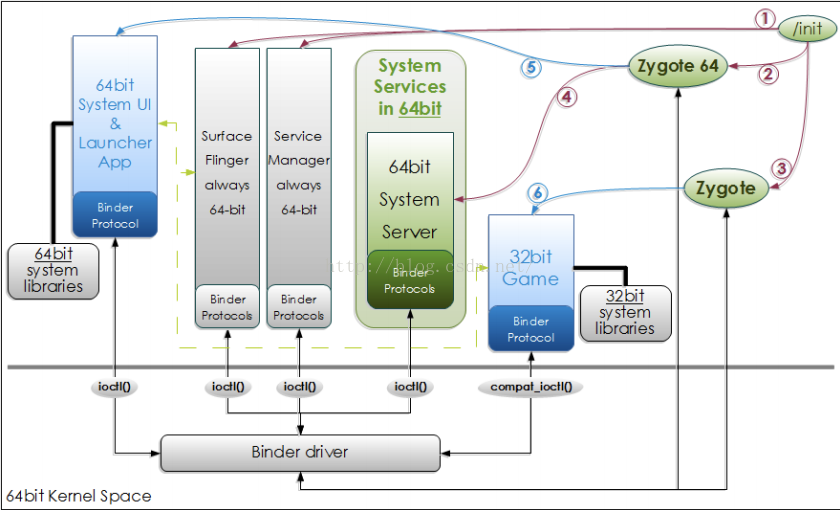
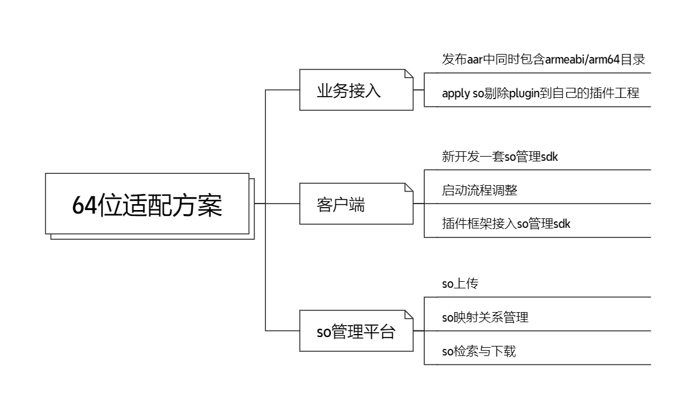
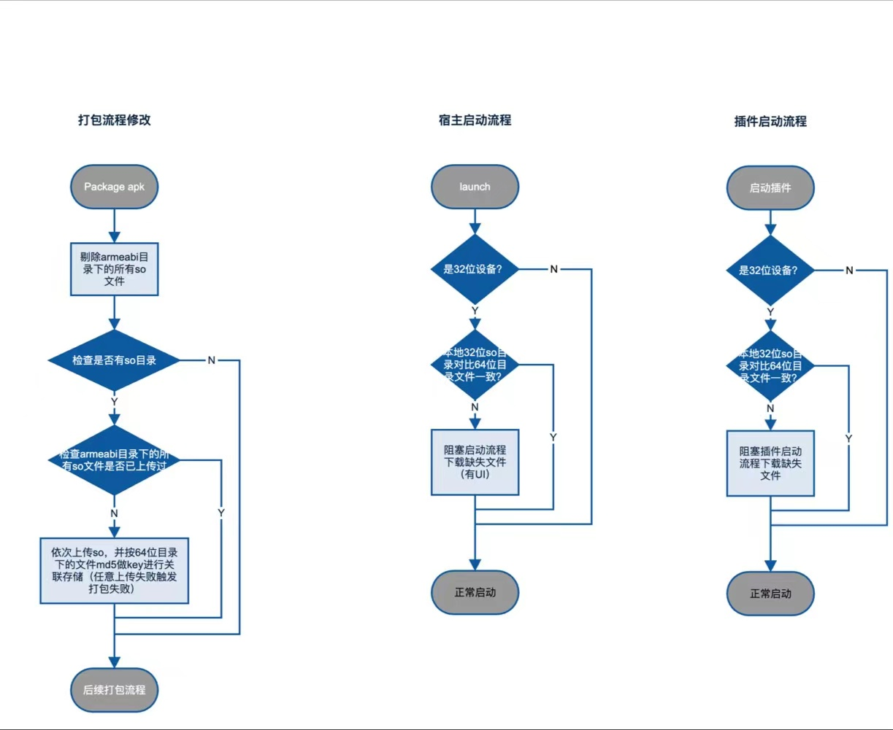

## 一、背景

- 1、目前32位用户占比仅0.5%；
- 2、当前App依旧使用32位架构，不能发为64位设备性能优势，Vss溢出问题严重；
- 3、小米、OPPO、vivo联合推进64位架构适配，华为支持aab分包方案。

## 二、系统如何兼容32位和64位
安装时仅携带64位so的App无法安装在32位手机设备上，仅携带32位so和32位&64位so都携带的App可以在所有设备安装，安装后32位和64位so会被释放到App不同的文件路径，
跟base.apk同源，只读。

启动时见下图，概括来讲系统会根据安装时解压的so路径是否包含64位名称的路径来觉得是从Zygote64 fork进程还是从Zygote fork进程。换句话说，如果App携带了空的64位abi目录，
安装后系统会误认为此App是支持64位架构的，从而区对应目录找相关的so，如果找不到就会产生崩溃。




## 三、备选方案

### 3.1 宿主
|  | 方案 | 优势 | 劣势 
|-------|-------|-------|------|
| 1 | 一个宿主同时包含32位so和64位so | 方便管理；<br> 不影响用户打开App成功率； | 显著增加包体积，与目前so库数量以及大小有关系
| 2 | 32位和64位各一个宿主包 | 不影响包体积； <br> 不影响用户打开成功率； | 所有的出包流程都要改变; <br> 渠道包数量增加；
| 3 | 一个宿主包默认写到64位so，<br> 动态下发32位so | 不影响出包流程 ；<br> 最大化覆盖64位设备用户；| 32位用户设备用户启动需要等待so下载； <br> 需要开发so管理平台，客户端需要对应so管理sdk

### 3.2 插件

|  | 方案 | 优势 | 劣势 
|-------|-------|-------|------|
| 1 | 插件下沉so文件到宿主 |减少插件包体积，节省动态发版成本；<br> 插件不需要另外适配64位架构； | 不能支持插件动态引入、升级so库
| 2 | 32位和64位各出一个插件| 不影响插件动态能力； | 插件管理平台和sdk有研发成本; <br> 增加插件包的管理成本；
| 3 | 插件同时携带32位和64位so包 | 不影响插件管理流程 ；<br> 插件框架做改动即可适配；| 增加部分插件的发版流量； <br> 增加宿主包体积

## 四、最终方案

### 4.1 so管理后台
本质是一个文件管理平台，使用32位so的md5做key去查找与之对应的32位so，上传时候就按照这个方式绑定映射关系，多次构建时如果so没有改变且后台已经有了就不需要重复上传。

|  | 功能点 |方案 | 使用场景 
|-------|-------|-------|------|
| 1 | so文件缺失查询接口|入参：32位so文件名_md5值列表；<br> 返回：缺少32位so的名称列表，以及本次查询数据中已经存在的32位url | 打包
| 2 | so文件上传提交接口| 到时候根据接口1返回情况补充上传32位so去到cdn链接，通过次接口上传到管理平台<br> 入参：“32位文件lib名_md5值：url” 列表 |打包


### 4.2 宿主（基于方案3）
- 1、要求所有的lib必须同时包含32位和64位 so;
- 2、打包时通过gradle plugin剔除32位so包，同时上传至so管理后台；
- 3、在64位设备上正常打开，在32位设备上打开时阻塞用户流程（仿照隐私合规协议部分），校验本地so文件是否匹配，下载缺失的so;

### 4.3插件（复用宿主so管理能力）
- 1、要求所有的lib必须同时包含32位和64位 so;
- 2、打包时通过gradle plugin剔除32位so包，同时上传至so管理后台；
- 3、在64位设备上正常打开，在32位设备设备启动时优先下载缺失的so文件，校验完整性通过后走常规启动流程。（本身插件加载即位异步行为）

### 4.4 整体流程


## 五、部分核心代码
### 5.1 处理so文件的加载
当Apk安装到用户设备上的时候，so相关的内容会被加压到 **/data/app/($package-name)-(&random-string)/lib/(&arch)/** 中，
其中 package-name 是应用的包名，random-string 是由系统生成的随机字符串，用于确保目录唯一性，arch 是指具体的架构目录。

既然如此，我们将后置的下载的so放在这个目录是不是就可以直接加载了？
答案是否定的，这个目录对于App来说是只读的，不能往里直接塞文件。

System.loadLibrary() 通过调用线程的上下文ClassLoader来加载指定的库。在 Android 应用中，默认的类加载器通常会走到BaseDexClassLoader，此类包含了DexPathList对象，该对象有几个与so加载的属性，其中包括
- nativeLibraryDirectories：这是一个目录列表，包含应用 APK 内部的 /lib/ 目录
- systemNativeLibraryDirectories：包含系统级的共享库目录，如 /system/lib 或 /system/lib64，这些目录存放系统共享库。
- nativeLibraryPathElements：由前者作为参数生成，ClassLoader.findLibaray内部从此数组中查找so文件

根据上述条件可知，我们需要将后置下载的so路径添加到nativeLibraryPathElements中，代码如下，以Android 26为例：

```java
class NativeLibsDirCompatApi26 implements INativeLibsDirCompat {

    private final List<File> mNativeLibDirs = new ArrayList<>();

    @Override
    public void insert(Context context, File dir) {
        try {
            mNativeLibDirs.add(0, dir);

            Class classLoaderClazz = Class.forName("dalvik.system.BaseDexClassLoader");
            Field pathListField = ReflectUtil.getField(classLoaderClazz, "pathList");
            Object pathList = pathListField.get(context.getClassLoader());

            List<File> nativeLibDirsNew = new ArrayList<>();

            Field nativeLibDirsField = ReflectUtil.getField(pathList.getClass(),"nativeLibraryDirectories");
            ArrayList<File> nativeLibDirs = (ArrayList<File>) nativeLibDirsField.get(pathList);

            Field systemNativeLibDirsField = ReflectUtil.getField(pathList.getClass(), "systemNativeLibraryDirectories");
            List<File> systemNativeLibDirs = (List<File>) systemNativeLibDirsField.get(pathList);

            //将后置so路径与之前classloader内部的路径构建一个List,通过makePathElements方法来构建nativeLibraryPathElements
            nativeLibDirsNew.addAll(mNativeLibDirs);
            nativeLibDirsNew.addAll(nativeLibDirs);
            nativeLibDirsNew.addAll(systemNativeLibDirs);

            Method makePathElements = ReflectUtil.getMethod(pathList.getClass(), "makePathElements", List.class);
            Object[] elements = (Object[]) makePathElements.invoke(pathList, nativeLibDirsNew);

            Field nativeLibPathElementsField = ReflectUtil.getField(pathList.getClass(), "nativeLibraryPathElements");
            nativeLibPathElementsField.set(pathList, elements);
        } catch (Throwable e) {
            e.printStackTrace();
        }
    }
}

```
ClassLoader在一些版本上有少量变化，需要对不同Api版本进行适配。

做完上述工作本以为就可以万事大吉了，但是又迎来了新问题，在Android高版本的设备加载so文件时候，如果so内部section记录了依赖其他的so，就会报UnsatisfiedLinkError，找不到依赖的so文件。
经查证后发现，Android 7.0引入的NameSpace机制间接导致这个问题。
- Namespace 绑定：在创建 ClassLoader 实例时，相关的库搜索路径（例如 nativeLibraryDirectories）会被绑定到一个特定的命名空间。这些路径包括应用的私有库目录以及任何额外指定的库目录。
- 命名空间隔离：每个命名空间可以配置为只能看到特定的其他命名空间，这样，即使两个应用使用了相同的库名称，它们也不会冲突，因为每个应用加载库的命名空间是隔离的。
- 加载过程： 当调用 dlopen 加载库时，Linker不再遍历所有可能的目录来查找库文件。而是仅在与当前 ClassLoader 关联的命名空间中配置的路径集合中搜索。如果 ClassLoader 的路径被更新（例如，通过反射添加新的路径），而没有相应更新命名空间中的绑定，这些新路径就被忽略掉了。
  
由于NameSPace的引入，之前通过修改 BaseDexClassLoader.DexPathList 的 nativeLibraryDirectories 进行动态库注入的操作就会出现问题。这是因为 ClassLoader 的路径集合&nativeLibraryPathElements更新了，如果没有相应地更新命名空间的配置，Linker不能识别这些新增的路径。

解决办法：
- 在加载某个so文件之前，先提前手动加载一下其依赖的so文件，这样Linker检查到已经被加载了，也就不会再走检索逻辑
- 使用三方库ReLinker,直接接管系统加载so文件的流程，内部解析依赖的so，完成加载。


### 5.2 剔除so的Gradle Plugin
前面在介绍方案的时候有说简单概述so文件的处理，打包时通过gradle plugin剔除32位so包，同时上传至so管理后台。

由于so的管理是使用文件md5作为key，故选择处理的打包时机是merge${buildType}NativeLibs。


```java
project.afterEvaluate {
        android.applicationVariants.all { variant ->
                String typeStrCapitalize = Utils.capitalize(variant.getName())

                //选定需要处理的task
                Task mergeNativeLibsTask = project.tasks.getByName("merge${typeStrCapitalize}NativeLibs")
                mergeNativeLibsTask.doLast {
                    //执行提出并上传的行为
                    new UploadSoAction(project, variant).doAction()
                }
        }
}

```

下面是doAction的部分核心逻辑
```java
        Log.i(Constants.TAG, "======= start to upload 32/64 so =======")
        long start = System.currentTimeMillis()

        DsoConfig config = project.extensions.findByName(Constants.DSO_CONFIG)
        File intermediatesFile = variant.getVariantData().getScope().getGlobalScope().getIntermediatesDir()
        File mergedNativeLibsDir = new File(intermediatesFile, "merged_native_libs/${variant.getName()}/out/lib")
        File assetDir = new File(intermediatesFile, "merged_assets/${variant.getName()}/out")
        File deletedSo32Dir = new File(intermediatesFile, "dynamic_so_libs/${variant.getName()}/out/lib/armeabi")
        File deletedSo64Dir = new File(intermediatesFile, "dynamic_so_libs/${variant.getName()}/out/lib/arm64-v8a")

        // 不存在so
        if (!mergedNativeLibsDir.exists()) {
            Log.i(Constants.TAG, "======= finish upload 32 so, cost ${System.currentTimeMillis() - start} ms =======")
            return
        }
        // 获取 armeabi 以及 arm64-v8a 中的 so 文件
        File so64Dir = new File(mergedNativeLibsDir, "arm64-v8a")
        File so32Dir = new File(mergedNativeLibsDir, "armeabi")

        // armeabi arm64-v8a 为空
        if (isSoDirEmpty(so64Dir) && isSoDirEmpty(so32Dir)) {
            Log.i(Constants.TAG, "======= finish upload 32 so, cost ${System.currentTimeMillis() - start} ms =======")
            return
        }
        // arm64-v8a 为空
        if (isSoDirEmpty(so64Dir)) {
            throw new IllegalArgumentException("缺少64位so！")
        }

        // 如果没有clean，尝试恢复删除的 armeabi so
        if (!isSoDirEmpty(deletedSo32Dir)) {
            File[] deletedSo32Files = listSoFiles(deletedSo32Dir)
            if (deletedSo32Files != null) {
                deletedSo32Files.each {
                    boolean isIn64SoDir = soFileContains(it.getName(), so64Dir)
                    boolean isIn32SoDir = soFileContains(it.getName(), so32Dir)
                    if (isIn64SoDir && !isIn32SoDir) {
                        FileUtils.copyFile(it, new File(so32Dir, it.getName()))
                    }
                }
            }
        }
         // armeabi 为空
        if (isSoDirEmpty(so32Dir)) {
            throw new IllegalArgumentException("缺少32位so！")
        }

        // 检查 armeabi 和 arm64-v8a 中 so 是否对齐
        StringBuilder missingSo64 = new StringBuilder()
        StringBuilder missingSo32 = new StringBuilder()
        listSoFiles(so64Dir).each {
            Log.i(Constants.TAG, "64so: " + it.getName())
            boolean so32Exists = soFileContains(it.getName(), so32Dir)
            if (!so32Exists) {
                if (missingSo32.length() > 0) {
                    missingSo32.append(",")
                }
                missingSo32.append(it.getName())
            }
        }
        listSoFiles(so32Dir).each {
            Log.i(Constants.TAG, "32so: " + it.getName())
            boolean so64Exists = soFileContains(it.getName(), so64Dir)
            if (!so64Exists) {
                if (missingSo64.length() > 0) {
                    missingSo64.append(",")
                }
                missingSo64.append(it.getName())
            }
        }
        if (missingSo64.length() > 0) {
            throw new IllegalArgumentException("缺少64位so: " + missingSo64.toString())
        }
        if (missingSo32.length() > 0) {
            throw new IllegalArgumentException("缺少32位so: " + missingSo32.toString())
        }

        // 取出需要上传的 so 信息
        Map<String, SoInfo> dynamicSoInfoMap = new HashMap<>()
        listSoFiles(so32Dir).each {
            //config.include32so，部分App打开就需要立刻使用的so无法后置，需要跟随apk产物 
            if (soFileContains(it.getName(), so64Dir) && (config.include32so == null || !config.include32so.contains(it.getName()))) {
                SoInfo soInfo = new SoInfo(it.getName(), it)
                dynamicSoInfoMap.put(soInfo.getKey(), soInfo)
            }
        }

        // 检查需要上传的 so 信息
        CheckUploadResponse.CheckUploadResponseData checkUploadResponseData = mUploadSoManager.checkNeedUpload(dynamicSoInfoMap.keySet())
        List<String> needUploadSoFiles = checkUploadResponseData.getListNeedUpload()
        List<UpdateSoInfoModel> uploadedList = checkUploadResponseData.getUploadedList()
        // 获取上传过的 so url
        if (uploadedList != null && !uploadedList.isEmpty()) {
            uploadedList.each {
                SoInfo soInfo = dynamicSoInfoMap.get(it.getLibMD5())
                if (soInfo != null) {
                    soInfo.setSoUrl(it.getSo32Url())
                }
            }
        }
        // 上传需要上传的 so
        if (needUploadSoFiles != null && !needUploadSoFiles.isEmpty()) {
            PreUploadResponse preUploadResponse = mUploadSoManager.preUpload()
            mUploadSoManager.upload(preUploadResponse, needUploadSoFiles, dynamicSoInfoMap)
        }

        // 写so信息到 dso_info.txt,内置到assets目录下，客户端sdk用于下载
        new SoInfoFileGenerator(project, variant, assetDir, "dso_info.txt", dynamicSoInfoMap).generateFile()

        // 转移并删除 32 so
        delete32so(deletedSo32Dir, dynamicSoInfoMap)

        Log.i(Constants.TAG, "======= finish upload 32/64 so, cost ${System.currentTimeMillis() - start} ms =======")
```


### 5.3 客户端so管理SDK
在5.2的Gradle Plugin中有介绍后置的so文件信息会写在dso_info.txt中，内置到assets目录下，客户端根据这个文件的内容进行增删改。

内部每一行为一个so文件信息，遵循下述格式
soFileName md5 downloadUrl


客户端逻辑整体分为三部分
- 配置文件读取
    - 文件没有找到：不需要进行so文件下载，返回成功
    - IO异常：读取失败，后续无法检验so完整性，返回失败
    - 有配置文件，但是读取内容为空，认为成功
- 完整性校验
    - 文件数量不一致，不完整
    - 单个so文件md5值校验失败，不完整
    - 对失效的so文件同时完成删除操作
- 下载
    - 新增的so
    - 变更的so
