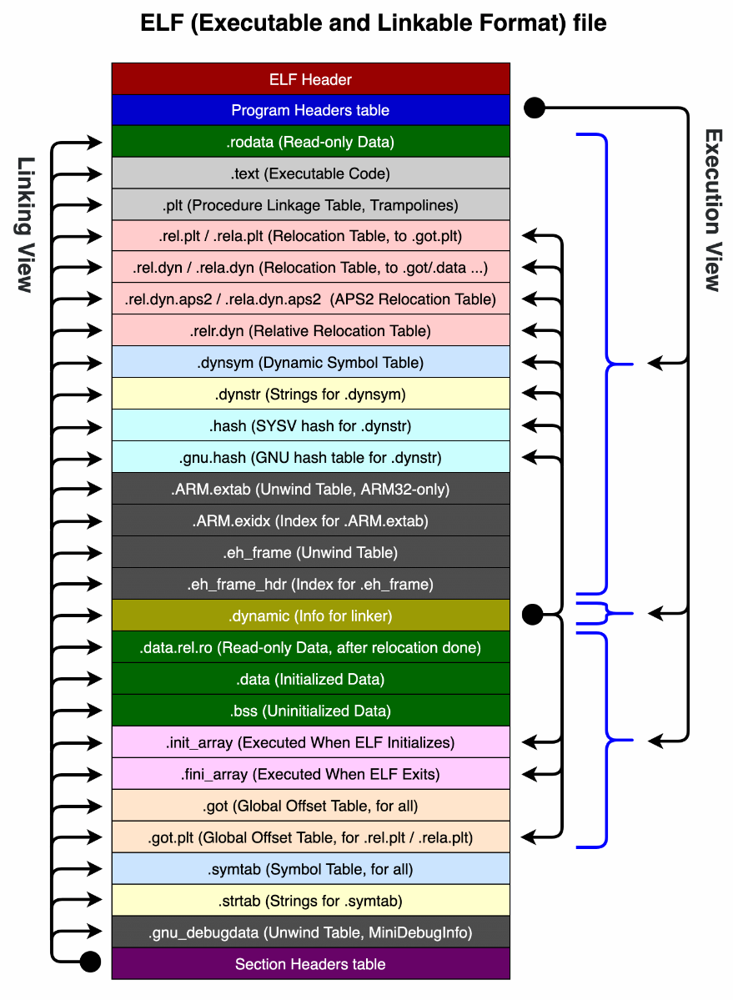

## 一、概述
随着大家对安全和性能越来越关注，NDK在Android日常开发中所占比重逐渐升高，同时也带来了Native代码的相关问题，为了对这些问题进行监控以及解决，Native Hook相关的技术也逐渐火热。本期文章给大家介绍一下Android PLT Hook技术的相关内容，抛砖引玉。
此技术主要用于批量Hook外部函数调用（性能监控是其主要使用场景）。
## 二、预备知识
想要对PLT Hook技术有一个了解，需要先学习一下ELF文件格式（Android NDK开发生成的.so文件即为ELF文件）以及链接、重定位相关的知识。   

这部分内容非常庞杂， 这里只能简单的介绍一下个人认为比较重要的内容，如果想深入了解，小伙伴们还需要自己在网上查一些相关资料（推荐《程序员的自我修养 :链接、装载与库》）。
### 2.1 ELF文件
无论是Dex文件还是ELF文件，其实都只是某些系统制定的规则而已，也就是以何种方式将代码和数据排列在一起，以便于系统进行解析。
  

ELF Header即文件头，用于描述整个ELF文件的基本信息。
在图中，文件内容按照不同的功能被划分为一条一条的节(Section)，下面对部分节(Section)做简单介绍：

 - .text 保存了程序代码指令的代码节
 - .plt 过程链接表，包含了动态链接器调用从共享库导入的函数所必须的相关代码。其实这个节就是一个跳板，当调用内部或者是外部的符号的时候，.plt会从.got(也可能是.data,.data.rela等)中，查询符号的地址，然后进行跳转。
 - .dynamic 动态链接中最重要的节，保存着动态链接器所需要的基本信息，比如依赖的共享对象、动态链接符号表的位置、动态链接重定位表的位置等。执行Hook操作也需要读取此节中的信息。
 - .got.plt 全局偏移表，主要包含符号类型为函数的符号地址(外部函数的绝对地址)。
 - .dynsym 动态链接符号表，保存了从共享库导入的符号信息，比如我们C代码中调用了libc.so的某个函数，那么这个信息就会被记录到此处。.dynsym不会保存共享库内部的函数，只是记录一个引用信息。
 - .dynstr 动态符号字符串表，.dynamic记录引用信息，这一定会涉及到字符串相关的内容，.dynamic并没有直接将字符串信息保存在自己的节中，而是通过索引从.dynstr中进行查找。
 - .hash 符号哈希表，用于加快符号查找过程。
 - .rel.和.rela. 重定位节，保存着重定位相关的信息。
 - .interp 用于记录动态连接器的地址。

从整体上查看整个ELF文件，分为两种视图，分别为
 - <strong>链接视图（Linking View）</strong>：文件加载到内存之前，以节(Section)为单位进行组织的数据格式
 - <strong>执行视图（Execution View）</strong>：加载到内存中的之后，以段(Segment)为单位进行组织的数据格式

Section和Segment之间有什么关系呢？   
在代码转化为可形成文件的过程中，需要经历的一个重要步骤为“链接”（将主程序与其所依赖的模块之间建立联系，用于解决符号不明的问题，这个过程比较复杂，后续还会做一些简单介绍），在这之后将Section按照装载的权限（比如只读内存段）和是否装载划分成Segment。

### 2.2 动态链接&amp;重定位
在动态链接和重定位之前，还有一步操作就是装载，在Android中可以理解为调用System.loadLibrary加载共享库。  
下面我们举个例子看一下动态链接&amp;重定位的流程。
#### 2.2.1 动态链接 ####
假设，我们在Native代码中调用了一个其他共享库lib_share.so的share函数，然后将代码生成了一个ELF共享文件test.so。此时test.so并不知晓lib_share.so加载到内存中的具体地址，故调用share方法的地方用一个函数指针代替，函数指针的值也就是函数的地址写在.got表中（注意此时这函数指针仅仅为一个仅起到占位的作用，方便后续填充真实地址）。  
当我们加载test.so的时候，通过读取.dynamic中的信息，找到test.so需要依赖的其他EFL文件（共享库）的列表，然后统一进行加载，此处也就是将lib_share.so加载到内存中。
#### 2.2.2 重定位 ####
当lib_share.so加载到内存中之后，test.so开始执行重定位操作，也就是将之前的外部调用函数(此处为share方法)的方法指针指向lib_share.so文件中share方法的真实地址。通过解析.dynamic,.dynsym,.rel.*等，将地址填写到.got(也有可能是.data)中。后续在程序执行的时候，share方法就会根据.got中的方法地址进行调用。  
完成这一系列流程依赖的就是.interp中记录的<strong>动态链接器</strong>,也就是Android中的<a href="https://android.googlesource.com/platform/bionic/+/master/linker/" target="_blank">linker(戳进去是源码)</a>。
以上就是动态链接&amp;重定位的简化后的基本流程。

想对这部分有一个更加深入的了解，大家可以自己网上深入了解以下几块内容

 - <strong>静态链接</strong>：程序最开始都是静态链接，随着后续逐步的发展，才慢慢过度到动态了链接，两者的区别与各自出现的原因，感兴趣的可以了解一下。
 - <strong>地址无关代码</strong>：代码可以加载到任意内存进行执行，不受内部绝对地址的影响，即指令中需要修改的部分脱离出来，与数据放在一起,这样指令部分就可以保持不变，而数据部分则在每个进程拥有一个副本。so文件内部的代码就属于地址无关代码，这个是实现动态链接的基本条件。
 - <strong>延迟绑定</strong>：每次打开一个ELF文件，如果直接进行完整的动态链接操作，并不是必要的，因为可能ELF文件中很多方法根本不会被调用。所谓延迟绑定即为当函数第一次被调用到时才进行绑定（符号查找，重定位）。在Android上仅有CPU架构为MIPS设备才支持延迟绑定。

## 三、原理
在【2.2 动态链接&amp;重定位】讲完之后，PLT Hook的原理也就呼之欲出了。  
linker通过重定位操作，确定了外部调用函数的真实地址，并将其填充到.got节中。我们自己也通过类似于重定位的操作，读取并解析.dynamic,.dynsym找到重定位信息，最终找到系统在.got中填充的地址，将此处的地址修改成我们自己的代理函数的地址，即可完成Hook操作。  
到这里，是不是觉得很简单，其实不然，需要解决的问题还有很多

- (1).如何获取ELF文件的在内存中的首地址，Android上在低版本是有一些限制的。
- (2).linker在执行完重定位操作后，会将地址位置所在的内存也设为“只读”，所以第一步需要先修改地址所在内存的权限。
- (3).内存页面的处理器指令是有缓存的，在修改后需要将缓存清除，hook才能生效。
- (4).Android 8.0 引入 Linker Namespace 机制（同一个函数符号，在进程中可能存在多个实现），这对于Hook也增大了难度。
- (5).类似于Hidden Api，Android 高版本也限制了对系统so库的读取，想要Hook一些系统函数调用，需要绕过限制
- (6).线上可以稳定运行

## 四、现有成熟框架
听完第三节后面待解决的问题，是不是觉得要放弃了，其实这部分不需要我们从0做起，已经有比较成熟稳定的开源项目供大家与应用。
- <a href="https://github.com/iqiyi/xHook" target="_blank">xHook 戳进去是github地址</a>
- <a href="https://github.com/bytedance/bhook" target="_blank">bHook 戳进去是github地址</a>

>以上两个项目的核心贡献人员其实是一个人，后者是前者的升级款，完善了很多内容，如果想要深入一下，可以先从xHook看起，代码量相对小很多。后者在native崩溃兜底，环形调用，解决linker namespace机制等进行了完善。

## 五、应用
前面介绍了这么多，那么PLT Hook到底能做些什么呢？  
它的想象空间非常大！
### 5.1 Native内存泄露检测 ### 
可以尝试Hook系统调用malloc,free等内存操作函数，对自家或者是第三方应用内存应用泄露进行检测。也可以清晰了解各共享库申请的内存大小。
### 5.2 IO检测 ###
Java层的IO操作，最终都要调用到libopenjdkjvm.so,libjavacore.so,libopenjdk.so的open,write,close等函数，可以通过Hook这些函数对IO读写进行监控，以便于发现主线程文件读写，大文件读写，频繁小文件读写等问题。腾讯的开源框架Martix中涉及到io检测的部分，就是按照这个思路做的。
### 5.3 ANR捕获 ###
Android的ANR产生后，系统会将anr信息写入到/data/anr/trace.txt文件中，在部分Android版本中，这个文件因为系统权限限制导致不能读取。按照5.2中I/O检测的操作，我们尝试可以通过Hook文件读写函数，如果发现系统打开了trace.txt并准备向其写入内容，通过代理函数先将其写入到我们自己的文件中，方便后续分析。
### 5.4 其他

通过hook socket的一些方法，监听socket方法的生命周期；  
通过hook  __android_log_write 等方法，过滤或者是保存log日志；  
修复部分系统bug；

注：图片来源自xHook

