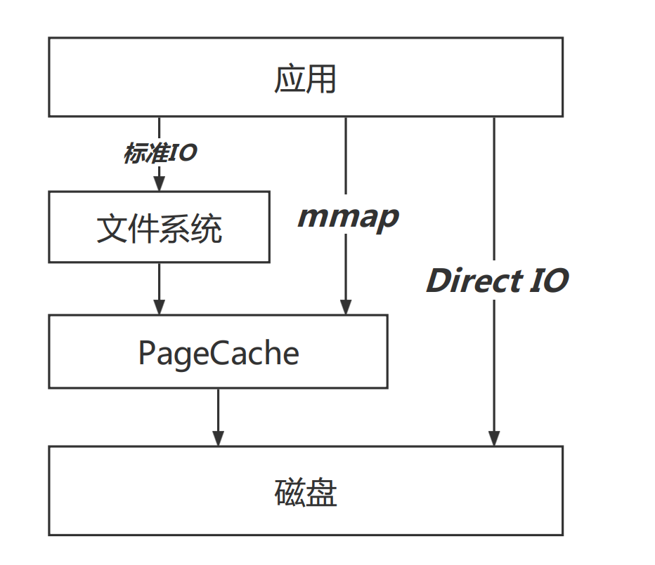

##  日常疑惑
1、如何评判磁盘的性能？  
2、磁盘读写偶尔突然变得很慢？  
2、为什么很多Android手机用了久了就会变卡？  


## 概述
Android开发，一般提到IO优化，我们想到的就是不要在主线程读写大文件，真的只有这么简单吗？


## 一、 预备知识
### 1.1 磁盘IO性能指标
#### 1.1.1、吞吐量
单位时间内成功传输的数据量。一般在商家对磁盘的宣传核心就体现在这个方面，xxxMB/s。
#### 1.1.2、IOPS
Input/Output Per Second，每秒读写次数。从机械硬盘到闪存固态硬盘消除了磁盘的物理寻址行为，IOPS有了质上的提升。


### 1.2 固态硬盘(闪存)的部分特性
1、先擦后写 \
2、块擦页写 \
3、损耗均衡 \
其中先擦后写与块擦页写是有其物理性质决定的\
损耗均衡是为了延长固态硬盘的使用寿命。

这些特性带来了一个问题，写入放大。

### 1.3 写入放大
写入放大是闪存和固态硬盘中一种不良的现象，即实际写入的物理数据量是写入数据量的多倍。

由于闪存在可重新写入数据前必须先擦除，执行这些操作就会多次移动（或改写）用户数据和元数据。因此，要改写数据，就需要读取闪存某些已使用的部分，更新它们，并写入到新的位置，如果新位置在之前已被使用过，还需连同先擦除；由于闪存的这种工作方式，必须擦除改写的闪存部分比新数据实际需要的大得多。此倍增效应会增加请求写入的次数，缩短SSD的寿命，从而减小SSD能可靠运行的时间。增加的写入也会消耗闪存的带宽，此主要降低SSD的随机写入性能。

当然，厂商为此也进行了一些优化，比如TRIM指令和预留空间等。

对于一些Android手机，用久了之后，有很明显的卡顿现象，除了整体配置已经过时外，一般发生在手机存储已经占用了大部分的情景下，伴随着写入放大问题，导致卡顿。
### 1.4 IO模型



**标准IO**：正常我们调用文件系统对外暴露的Api，比如open，read等相关文件操作函数，会先走文件系统内部的缓存与调度系统，文件系统经过调度后向PageCache发起io请求，如果没有命中，PageCache再向磁盘进行交互。

**mmap**：绕过了文件系统，通过内存映射与PageCache进行交互，减少了一次文件拷贝。

**Direct IO**：直接与磁盘的IO层进行交互，减少了PageCache层的拷贝。第一次操作速度快，后续就不如传统方式了。


## 二、IO监控监控指标建设

### 2.1 PLT Hook
之前写过一篇介绍Android PLT Hook的文章，感兴趣的同学可以了解一下。

PLT Hook用于批量Hook ELF文件的外部调用，性能监控是其应用方向之一。

### 2.2 对IO相关方法进行Hook
Android中IO相关方法最终都会调用到libc.so中如下几个方法：
```c
int open(const char *pathname, int flags, mode_t mode);
int open64(const char *pathname, int flags, mode_t mode);
ssize_t read(int fd, void *buf, size_t size);
ssize_t __read_chk(int fd, void *buf, size_t size,size_t buf_size);
ssize_t write(int fd, const void *buf, size_t size); 
ssize_t __write_chk(int fd, const void *buf, size_t size,size_t buf_size); 
int close(int fd);
```

下面是一个小Demo，用到的是爱奇艺开源的PLT Hook框架xHook

```c

//定义两个方法指针，用于指向被Hook的源方法，方便我们在proxy方法中调用原方法
static int (*original_open) (const char *pathname, int flags, mode_t mode);
static ssize_t (*original_read) (int fd, void *buf, size_t size);

//代理方法,用于替换Got表中原方法
ssize_t proxy_read(int fd, void *buf, size_t size) {
    size_t ret = original_read(fd, buf, size);
    LOG_E("ProxyRead %d %s %d",fd,((char*)(buf)),size);
    return ret;
}
//代理方法,用于替换Got表中原方法，无论用户读取哪个文件，都只将读取到records.txt
int proxy_open(const char *pathname, int flags, mode_t mode) {
    int ret = original_open("/data/user/0/com.itkxl.learn.xhook/files/records.txt", flags, mode);
    LOG_E("ProxyOpen %s",pathname);
    return ret;
}

//执行Hook行为
void doHook(){
    int open_result = xhook_register("libjavacore.so","open",(void*)proxy_open, (void**)&original_open);
    LOG_E("open_result %d",open_result);

    int read_result = xhook_register("libjavacore.so","read",(void*)proxy_read, (void**)&original_read);
    LOG_E("read_result %d",read_result);
    xhook_refresh(1);
}
```
### 2.3 监控的维度
根据上面给出的被代理的方法，可以给出以下几个维度进行监控

|方法名|维度|
|---|---|
|open|文件名、fd、堆栈、线程|
|read、write|fd、buffer大小、读写内容大小|
|close|打开文件总耗时|

根据以上几个维度，通过监控解决以下几个不合理行为

|不合理IO|说明|
|---|---|
|主线程读写|由于写入放大的存在，主线程小文件读写也是可能间接造成ANR的|
|文件重复打开|对于某些配置文件，可进行缓存，尤其在打开App的时候，如果对文件多次重复打开读写，抢占带宽，影响启动速度|
|Buffer设置不合理|Buffer设置过小，会影响读写速度|

## 三、Matrix解析&拓展

### 3.1 Hook方法选择
Matrix目前仅做Java层的IO行为监控，主要监听so文件如下
- libopenjdkjvm.so
- libjavacore.so
- libopenjdk.so


```cpp

//文件打开
xhook_got_hook_symbol(soinfo, "open", (void*)ProxyOpen, (void**)&original_open);
xhook_got_hook_symbol(soinfo, "open64", (void*)ProxyOpen64, (void**)&original_open64);

//文件读取
xhook_got_hook_symbol(soinfo, "read", (void*)ProxyRead, (void**)&original_read)
xhook_got_hook_symbol(soinfo, "__read_chk", (void*)ProxyReadChk, (void**)&original_read_chk) 

//文件写入
xhook_got_hook_symbol(soinfo, "write", (void*)ProxyWrite, (void**)&original_write)
xhook_got_hook_symbol(soinfo, "__write_chk", (void*)ProxyWriteChk, (void**)original_write_chk)

//文件关闭
xhook_got_hook_symbol(soinfo, "close", (void*)ProxyClose, (void**)&original_close);
xhook_got_hook_symbol(soinfo,"android_fdsan_close_with_tag",(void *)Proxy_android_fdsan_close_with_tag,(void**)&original_android_fdsan_close_with_tag);
```
这些方法的监控，即可完成2.3中介绍的监控维度。

### 3.2 基础信息记录

#### 3.2.1 Open记录的信息

- 操作堆栈
- 线程名称

```cpp
static void DoProxyOpenLogic(const char *pathname, int flags, mode_t mode, int ret) {
    JNIEnv* env = NULL;
    kJvm->GetEnv((void**)&env, JNI_VERSION_1_6);
    if (env == NULL || !kInitSuc) {
        __android_log_print(ANDROID_LOG_ERROR, kTag, "ProxyOpen env null or kInitSuc:%d", kInitSuc);
    } else {
        jobject java_context_obj = env->CallStaticObjectMethod(kJavaBridgeClass, kMethodIDGetJavaContext);
        if (NULL == java_context_obj) {
            return;
        }

        //记录堆栈，这里是通过JNI调用了java方法获取
        jstring j_stack = (jstring) env->GetObjectField(java_context_obj, kFieldIDStack);

        //记录线程名称（在Matrix实现里面，目前有些多余，后续会介绍）
        jstring j_thread_name = (jstring) env->GetObjectField(java_context_obj, kFieldIDThreadName);

        char* thread_name = jstringToChars(env, j_thread_name);
        char* stack = jstringToChars(env, j_stack);
        JavaContext java_context(GetCurrentThreadId(), thread_name == NULL ? "" : thread_name, stack == NULL ? "" : stack);
        free(stack);
        free(thread_name);

        //在OnOpen方法中构建IOInfo对象，同时记录了文件打开时间
        iocanary::IOCanary::Get().OnOpen(pathname, flags, mode, ret, java_context);

        env->DeleteLocalRef(java_context_obj);
        env->DeleteLocalRef(j_stack);
        env->DeleteLocalRef(j_thread_name);
    }
}
```

#### 3.2.2 Read&Write记录的信息

- 单次读写的时长
- Buffer size

```cpp
ssize_t ProxyRead(int fd, void *buf, size_t size) {
    //省略...

    //计算得到单次Read时长
    int64_t start = GetTickCountMicros();
    size_t ret = original_read(fd, buf, size);
    long read_cost_us = GetTickCountMicros() - start;

    //记录单次操作时长&buffer size；  fd用于将信息聚合
    iocanary::IOCanary::Get().OnRead(fd, buf, size, ret, read_cost_us);
    return ret;
}
```

IOCanary::Get().OnRead后续还有其他的信息记录
- 当前读写次数
- 当前读写总大小
- 当前读写总时长
- 当前单次读写最大时长
- 当前从开始读写到本次操作的总时长
- 当前连续读写总时长
- 当前最后一次读写时间

```cpp
void IOInfoCollector::CountRWInfo(int fd, const FileOpType &fileOpType, long op_size, long rw_cost) {
        //如果fd没有在之前的open中记录过，return
        if (info_map_.find(fd) == info_map_.end()) {
            return;
        }

        const int64_t now = GetSysTimeMicros();

        //分别记录读写次数，读写大小，使用时长
        info_map_[fd]->op_cnt_ ++;
        info_map_[fd]->op_size_ += op_size;
        info_map_[fd]->rw_cost_us_ += rw_cost;

        // 记录单次读写最大时长
        if (rw_cost > info_map_[fd]->max_once_rw_cost_time_μs_) {
            info_map_[fd]->max_once_rw_cost_time_μs_ = rw_cost;
        }

        // 记录从开始读写到本次操作的总时长
        if (info_map_[fd]->last_rw_time_μs_ > 0 && (now - info_map_[fd]->last_rw_time_μs_) < kContinualThreshold) {
            info_map_[fd]->current_continual_rw_time_μs_ += rw_cost;
        } else {
            info_map_[fd]->current_continual_rw_time_μs_ = rw_cost;
        }

        //记录连续读写总时长
        if (info_map_[fd]->current_continual_rw_time_μs_ > info_map_[fd]->max_continual_rw_cost_time_μs_) {
            info_map_[fd]->max_continual_rw_cost_time_μs_ = info_map_[fd]->current_continual_rw_time_μs_;
        }

        //记录最后一次读写时间
        info_map_[fd]->last_rw_time_μs_ = now;

        //记录buffer size
        if (info_map_[fd]->buffer_size_ < op_size) {
            info_map_[fd]->buffer_size_ = op_size;
        }


        if (info_map_[fd]->op_type_ == FileOpType::kInit) {
            info_map_[fd]->op_type_ = fileOpType;
        }
    }
```

#### 3.2.3 Close记录的信息

- 从打开到关闭的总时长
- 操作完成后文件的大小

```cpp
std::shared_ptr<IOInfo> IOInfoCollector::OnClose(int fd, int close_ret) {

    //如果fd没有在之前的open中记录过，return
    if (info_map_.find(fd) == info_map_.end()) {
        return nullptr;
    }

    // 记录从打开到关闭的总时长
    info_map_[fd]->total_cost_μs_ = GetSysTimeMicros() - info_map_[fd]->start_time_μs_;
    // 记录操作完成后文件的大小
    info_map_[fd]->file_size_ = GetFileSize(info_map_[fd]->path_.c_str());
    std::shared_ptr<IOInfo> info = info_map_[fd];

    //删除本地fd记录
    info_map_.erase(fd);
    
    return info;
}
```

在文件关闭的时候，会将整个IOInfo传递给一个异步的消息队列，进行异常分析
```cpp
 void IOCanary::OfferFileIOInfo(std::shared_ptr<IOInfo> file_io_info) {
    std::unique_lock<std::mutex> lock(queue_mutex_);
    queue_.push_back(file_io_info);
    queue_cv_.notify_one();
    lock.unlock();
}
```
### 3.3 问题分析

#### 3.3.1 主线程读写
由于目前Hook方法中，第一步直接就判断了线程，故此处为重复判断，增加了部分type信息。
```cpp
    void FileIOMainThreadDetector::Detect(const IOCanaryEnv &env, const IOInfo &file_io_info,
                                          std::vector<Issue>& issues) {
        //判断是否是主线程读写，如果是，则上报相关信息
        if (GetMainThreadId() == file_io_info.java_context_.thread_id_) {
            int type = 0;

            //判断最大单次读写时长是否超过阈值
            if (file_io_info.max_once_rw_cost_time_μs_ > IOCanaryEnv::kPossibleNegativeThreshold) {
                type = 1;
            }

            //判断主线程连续读写时长是否超过阈值
            if(file_io_info.max_continual_rw_cost_time_μs_ > env.GetMainThreadThreshold()) {
                type |= 2;
            }

            if (type != 0) {
                Issue issue(kType, file_io_info);
                issue.repeat_read_cnt_ = type;  //use repeat to record type
                PublishIssue(issue, issues);
            }
        }
    }
```
#### 3.3.2 Buffer设定不合理
```cpp
    void FileIOSmallBufferDetector::Detect(const IOCanaryEnv &env, const IOInfo &file_io_info,
                                           std::vector<Issue>& issues) {
        // 若果读写次数超过阈值&平均buffer size 小于阈值 & 连续读写时长超过阈值  则进行上报
        if (file_io_info.op_cnt_ > env.kSmallBufferOpTimesThreshold && (file_io_info.op_size_ / file_io_info.op_cnt_) < env.GetSmallBufferThreshold()
                && file_io_info.max_continual_rw_cost_time_μs_ >= env.kPossibleNegativeThreshold) {

            PublishIssue(Issue(kType, file_io_info), issues);
        }
    }
```
#### 3.3.3 重复读
```cpp
    void FileIORepeatReadDetector::Detect(const IOCanaryEnv &env,
                                          const IOInfo &file_io_info,
                                          std::vector<Issue>& issues) {
        
        // 由于要记录文件被重复打开次数，而fd每次打开可能是不一致的，故此处用path作为key进行聚合信息
        // 如果之前记录过&最大连续读写时长超过阈值，则进行记录，以path为key，对象RepeatReadInfo为value
        const std::string& path = file_io_info.path_;
        if (observing_map_.find(path) == observing_map_.end()) {
            if (file_io_info.max_continual_rw_cost_time_μs_ < env.kPossibleNegativeThreshold) {
                return;
            }

            observing_map_.insert(std::make_pair(path, std::vector<RepeatReadInfo>()));
        }

        // 只有文件在没有改变的情况下，多次读取才有记录的必要
        // 如果文件有write行为，即文件被改变了，则重复读的信息需要重新被记录
        std::vector<RepeatReadInfo>& repeat_infos = observing_map_[path];
        if (file_io_info.op_type_ == FileOpType::kWrite) {
            repeat_infos.clear();
            return;
        }

        //生成重复读记录对象
        RepeatReadInfo repeat_read_info(file_io_info.path_, file_io_info.java_context_.stack_, file_io_info.java_context_.thread_id_,
                                      file_io_info.op_size_, file_io_info.file_size_);

        //如果之前没记录过则直接保存本次信息
        if (repeat_infos.size() == 0) {
            repeat_infos.push_back(repeat_read_info);
            return;
        }

        //如果同一个文件就近两次读写时长超过17ms,则清空记录情况
        if((GetTickCount() - repeat_infos[repeat_infos.size() - 1].op_timems) > 17) {   
            repeat_infos.clear();
        }

        bool found = false;
        int repeatCnt;

        //循环遍历同一个path下的文件读情况，如果堆栈信息，线程名等都一致，则增加重复读次数
        for (auto& info : repeat_infos) {
            if (info == repeat_read_info) {
                found = true;

                info.IncRepeatReadCount();

                repeatCnt = info.GetRepeatReadCount();
                break;
            }
        }

        if (!found) {
            repeat_infos.push_back(repeat_read_info);
            return;
        }

        //重复读次数超过阈值，则进行上报
        if (repeatCnt >= env.GetRepeatReadThreshold()) {
            Issue issue(kType, file_io_info);
            issue.repeat_read_cnt_ = repeatCnt;
            issue.stack = repeat_read_info.GetStack();
            PublishIssue(issue, issues);
        }
    }
```


### 3.4 优化&拓展
- 获取堆栈信息频繁：在文件open的时候，立刻获取了堆栈信息，开销较大。优化为在close的，判断时长是否超过一定阈值，如果超出则获取close的堆栈，效果类似，极大地减少了堆栈获取次数。
- 目前仅检测Java相关的内容：可以优化为对libc.so中的io方法直接进行监控，这样不仅仅局限于Java，还能涵盖Native相关。
- 目前仅检测主线程相关信息：因为有锁的关系，这部分如果放开，需要全局采用异步消息队列的形式来处理。
- 部分文件是通过mmap进行操作，这部分目前是做其监控的。