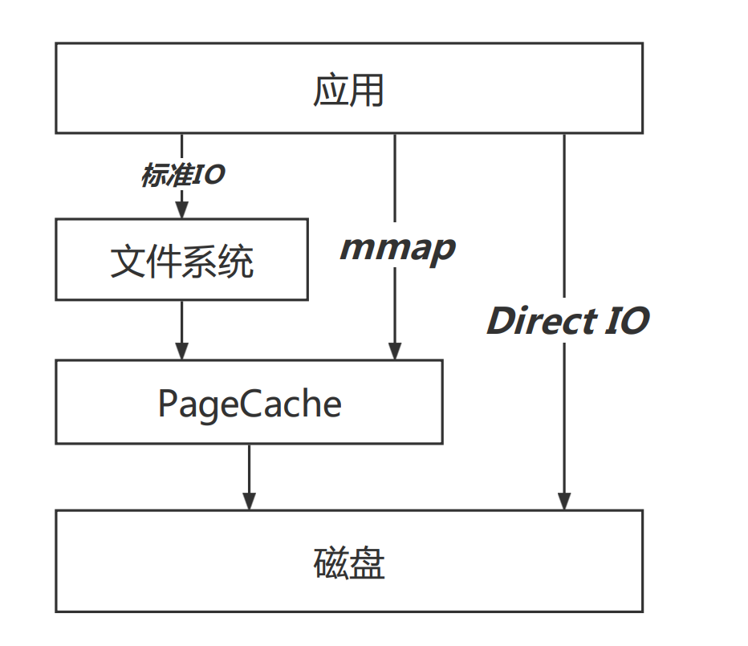

#  日常疑惑
1、如何评判磁盘的性能？  
2、磁盘读写偶尔突然变得很慢？  
2、为什么很多Android手机用了久了就会变卡？  


# 概述
Android开发，一般提到IO优化，我们想到的就是不要在主线程读写大文件，真的只有这么简单吗？


# 一、 预备知识ad
## 1.1 磁盘IO性能指标
### 1.1.1、吞吐量
单位时间内成功传输的数据量。一般在商家对磁盘的宣传核心就体现在这个方面，xxxMB/s。
### 1.1.2、IOPS
Input/Output Per Second，每秒读写次数。从机械硬盘到闪存固态硬盘消除了磁盘的物理寻址行为，IOPS有了质上的提升。


## 1.2 固态硬盘(闪存)的部分特性
1、先擦后写 \
2、块擦页写 \
3、损耗均衡 \
其中先擦后写与块擦页写是有其物理性质决定的\
损耗均衡是为了延长固态硬盘的使用寿命。

这些特性带来了一个问题，写入放大。

## 1.3 写入放大
写入放大是闪存和固态硬盘中一种不良的现象，即实际写入的物理数据量是写入数据量的多倍。

由于闪存在可重新写入数据前必须先擦除，执行这些操作就会多次移动（或改写）用户数据和元数据。因此，要改写数据，就需要读取闪存某些已使用的部分，更新它们，并写入到新的位置，如果新位置在之前已被使用过，还需连同先擦除；由于闪存的这种工作方式，必须擦除改写的闪存部分比新数据实际需要的大得多。此倍增效应会增加请求写入的次数，缩短SSD的寿命，从而减小SSD能可靠运行的时间。增加的写入也会消耗闪存的带宽，此主要降低SSD的随机写入性能。

当然，厂商为此也进行了一些优化，比如TRIM指令和预留空间等。

对于一些Android手机，用久了之后，有很明显的卡顿现象，除了整体配置已经过时外，一般发生在手机存储已经占用了大部分的情景下，伴随着写入放大问题，导致卡顿。
## 1.4 IO模型



**标准IO**：正常我们调用文件系统对外暴露的Api，比如open，read等相关文件操作函数，会先走文件系统内部的缓存与调度系统，文件系统经过调度后向PageCache发起io请求，如果没有命中，PageCache再向磁盘进行交互。

**mmap**：绕过了文件系统，通过内存映射与PageCache进行交互，减少了一次文件拷贝。

**Direct IO**：直接与磁盘的IO层进行交互，减少了PageCache层的拷贝。第一次操作速度快，后续就不如传统方式了。


# 二、IO监控

## 2.1 PLT Hook
之前写过一篇介绍Android PLT Hook的文章，感兴趣的同学可以了解一下。

//todo

PLT Hook用于批量Hook ELF文件的外部调用，性能监控是其应用方向之一。

## 2.2 对IO相关方法进行Hook
Android中IO相关方法最终都会调用到libc.so中如下几个方法：
```c
int open(const char *pathname, int flags, mode_t mode);
int open64(const char *pathname, int flags, mode_t mode);
ssize_t read(int fd, void *buf, size_t size);
ssize_t __read_chk(int fd, void *buf, size_t size,size_t buf_size);
ssize_t write(int fd, const void *buf, size_t size); 
ssize_t __write_chk(int fd, const void *buf, size_t size,size_t buf_size); 
int close(int fd);
```

下面是一个小Demo，用到的是爱奇艺开源的PLT Hook框架xHook

```c

//定义两个方法指针，用于指向被Hook的源方法，方便我们在proxy方法中调用原方法
static int (*original_open) (const char *pathname, int flags, mode_t mode);
static ssize_t (*original_read) (int fd, void *buf, size_t size);

//代理方法,用于替换Got表中原方法
ssize_t proxy_read(int fd, void *buf, size_t size) {
    size_t ret = original_read(fd, buf, size);
    LOG_E("ProxyRead %d %s %d",fd,((char*)(buf)),size);
    return ret;
}
//代理方法,用于替换Got表中原方法，无论用户读取哪个文件，都只将读取到records.txt
int proxy_open(const char *pathname, int flags, mode_t mode) {
    int ret = original_open("/data/user/0/com.itkxl.learn.xhook/files/records.txt", flags, mode);
    LOG_E("ProxyOpen %s",pathname);
    return ret;
}

//执行Hook行为
void doHook(){
    int open_result = xhook_register("libjavacore.so","open",(void*)proxy_open, (void**)&original_open);
    LOG_E("open_result %d",open_result);

    int read_result = xhook_register("libjavacore.so","read",(void*)proxy_read, (void**)&original_read);
    LOG_E("read_result %d",read_result);
    xhook_refresh(1);
}
```
## 2.3 监控的维度
根据上面给出的被代理的方法，可以给出以下几个维度进行监控

|方法名|维度|
|---|---|
|open|文件名、fd、堆栈、线程|
|read、write|fd、buffer大小、读写内容大小|
|close|打开文件总耗时|

根据以上几个维度，通过监控解决以下几个不合理行为

|不合理IO|说明|
|---|---|
|主线程读写|由于写入放大的存在，主线程小文件读写也是可能间接造成ANR的|
|文件重复打开|对于某些配置文件，可进行缓存，尤其在打开App的时候，如果对文件多次重复打开读写，抢占带宽，影响启动速度|
|Buffer设置不合理|Buffer设置过小，会影响读写速度|

# 三、IO重定向

在进行io操作之前，都要先执行open操作，由系统返回目标文件的对的文件操作符fd，此时酒精返回哪个文件描述符，可以由代理函数决定，这种行为就是标题所说的IO重定向。

## 3.1 沙盒应用
VirtualApp \
在沙盒应用中进行多开，除了要解决代码和资源的加载问题，还有一个问题也很重要，就是各个App读写文件路径隔离，这部分行为需要利用IO重定向进行操作。
## 3.2 灰产过签名校验
修改安装包是灰产的惯用手段之一，一般客户端可以通过安装包的签名校验进行防范，灰产可以利用IO重定向，将文件读写指向一个正常的安装包或文件来躲过签名校验以及md5文件校验。
