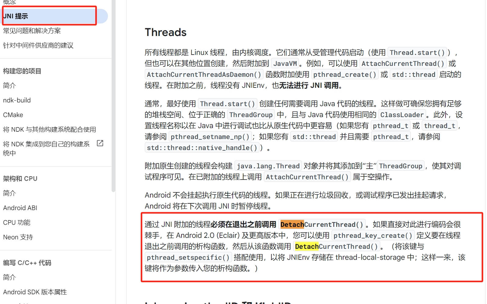

## 一、背景
在 JNI 中，当 Java 代码调用一个 native 方法时，JVM 会传递一个 JNIEnv 的指针给该方法。我们可以使用JNIEnv这个对象调用Java相关的方法，完成一些数据结构的转换。但是,JNI自身由很多需要注意的地方，尤其是在多线程下使用JNI,非常容易出现问题。下面将简单介绍一下我遇到的问题以及解决方式。
## 二、局部引用问题
在使用JNI的过程中，管理 JNI 局部引用是一个常见的问题，尤其是在处理大量 Java 对象时。JNI 中的局部引用是指向 Java 对象的引用，这些引用由本地代码（C 或 C++）创建，并且只在 JNI 函数的调用期间有效。如果不适当管理这些局部引用，可能会造成资源泄漏，甚至OOM。

日常开发需要注意的点

- 及时进行DeleteLocalRef
- PushLocalFrame&PopLocalFrame

```cpp
#include <jni.h>

JNIEXPORT void JNICALL Java_SampleMethod(JNIEnv *env, jobject obj) {
    jclass cls = env->FindClass("java/lang/String");
    jstring str;
    jint i;

    env->PushLocalFrame(10);  // 创建能容纳10个局部引用的框架
    for (i = 0; i < 100; i++) {
        str = env->NewStringUTF("Test String");
        // 使用 str 做一些工作
        env->DeleteLocalRef(str);  // 及时删除局部引用
    }
    env->PopLocalFrame(NULL);  // 销毁局部引用框架并释放所有局部引用
}

```


## 三、挂载与解绑问题
当Java直接调用Native方法的时候，在Native的方法的参数中会携带一个JNIEnv,其是与调用线程直接绑定的，并不能跨线程调用。
如果我在Native的多线程环境中，想使用JNIEnv操作Java对象或者方法，该如何做呢？
此时需要调用JavaVM的AttachCurrentThread方法来在当前线程初始化一个JNIEnv,或者说是将一个JNIenv对象绑定到当前线程。

```cpp
 jint jAttachRet = kJvm->AttachCurrentThread(&env, nullptr);
if (jAttachRet != JNI_OK) {
    //绑定失败
}else{
    //绑定成功
}
```

在这之后就可以愉快的使用JNIEnv相关的方法了。但其同时又带来另外一个问题，在使用完成或者是线程结束之前需要调用JavaVM的DetachCurrentThread方法，否则会导致线程服务法正常退出，甚至崩溃。

这里可能会有疑问，在使用Java方法直接调用Native方法时候，也没有调用DetachCurrentThread方法，为何没有问题？在刚说的这个场景下，实际上是系统帮我们在合适的时机调用了AttachCurrentThread&DetachCurrentThread。

这里如果也能自动调用相关的方法就好了，该怎么处理呢？
Android开发者的官网上有这样一段话:



按照这个思路，可以按照如下代码进行处理:

```cpp

static JavaVM *g_VM = nullptr;
static pthread_once_t g_onceInitTls = PTHREAD_ONCE_INIT;
static pthread_key_t g_tlsJavaEnv;

void init(JavaVM *vm) {
    if (g_VM) return;
    g_VM = vm;
}

JNIEnv *getEnv() {
    JNIEnv *env;
    // 判断当前线程是否已经Attach到Java虚拟机上，如果是，则env初始化完成
    int ret = g_VM->GetEnv(reinterpret_cast<void **>(&env), JNI_VERSION_1_6);

    // 当前线程未被Attach到虚拟机上
    if (ret != JNI_OK) {

        //使用 pthread_once 保证某些初始化代码（如 pthread_key_create）只执行一次。pthread_key_create 创建一个线程局部存储键（TLS），用于存储线程特定的数据。
        pthread_once(&g_onceInitTls, []() {
                //在 pthread_key_create 时提供的析构函数将在线程结束时调用，用于从 JVM 分离线程。这确保了资源的正确释放，防止内存泄漏。
                pthread_key_create(&g_tlsJavaEnv, [](void *d) {
                    if (d && g_VM)
                        g_VM->DetachCurrentThread();
                });
        });

        //执行Attach
        if (g_VM->AttachCurrentThread(&env, nullptr) == JNI_OK) {
                //attach成功的情况下，设置g_tlsJavaEnv的销毁函数中的入参值
                pthread_setspecific(g_tlsJavaEnv, reinterpret_cast<const void*>(1));
        } else {
                env = nullptr;
        }
    }
    return env;
}
```
使用 pthread_once 来安全地执行一次性初始化。利用 TLS 来存储和访问线程特定的数据，这里用它和销毁函数来标记是否需要在线程结束时从 JVM 分离，最终打到管理DetachCurrentThread的调用时机。