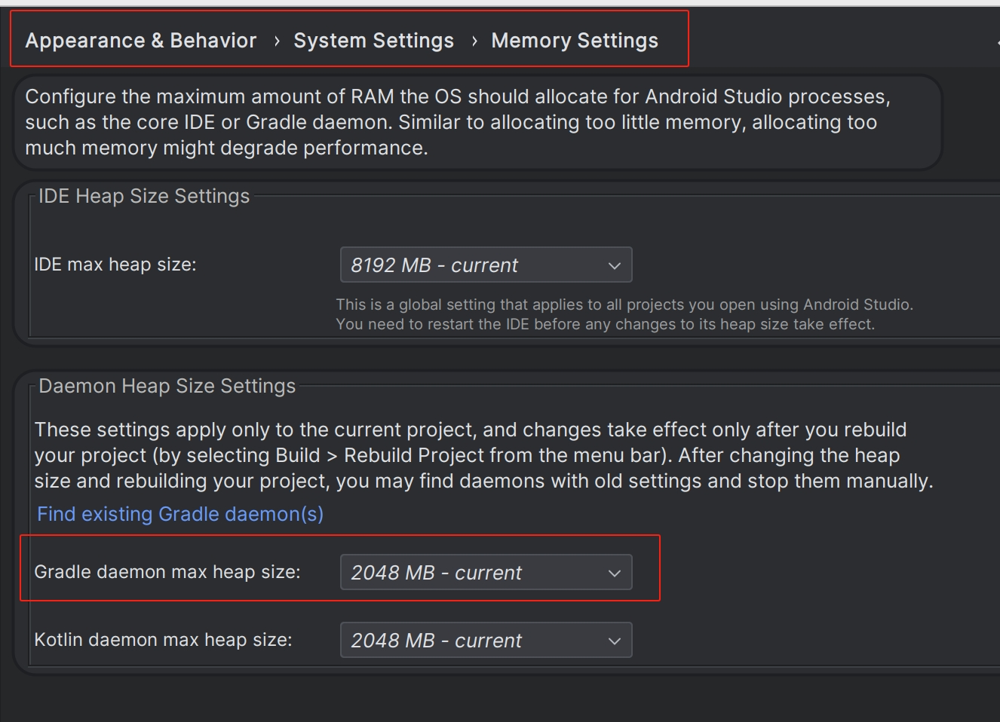
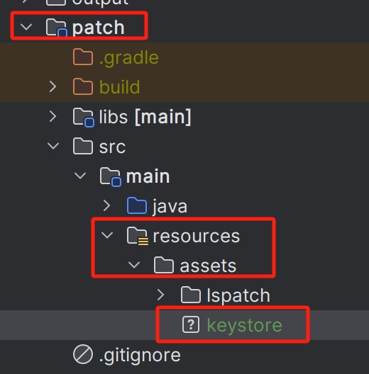
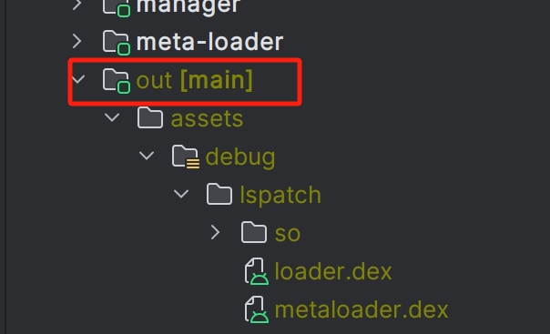
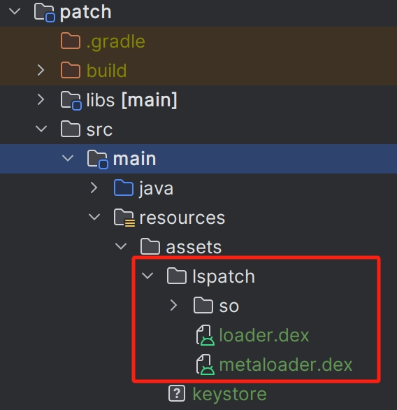
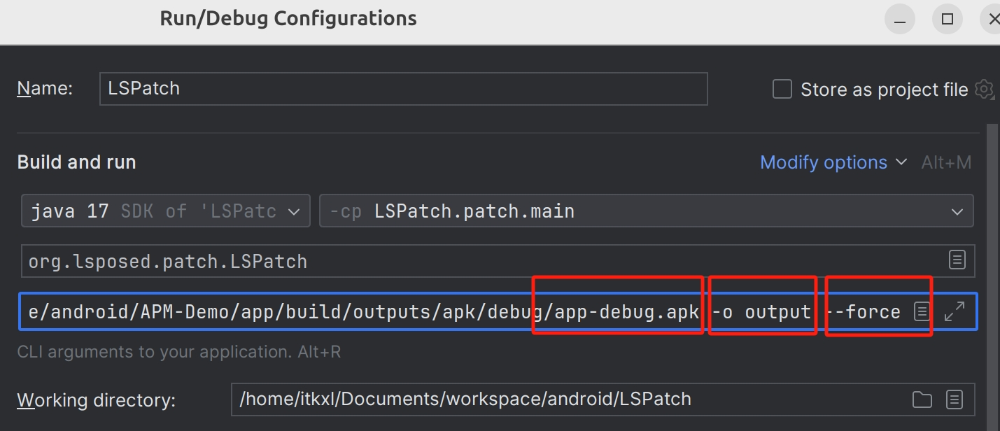

LSPatch 是一个基于 LSPosed 的非 root Xposed 框架。它通过重打包来实现对Apk的Hook。

## 一、本地环境
- Ubuntu 23.04
- git 2.40.1 
- Android Studio Iguana | 2023.2.1 Patch 1


## 二、源码拉取
git地址 https://github.com/LSPosed/LSPosed.git
```bash
git clone https://github.com/LSPosed/LSPosed.git
```
此时项目拉取下来，core文件夹为空，需要通过git submodule继续拉取才可
```bash
git submodule update --remote
git submodule update --init --recursive
```

## 三、编译

### 3.1调整Gradle编译内存
需要变更一下Gradle Heap size，直接编译会报gradle oom问题


### 3.2libxposed问题
```bash
Could not find io.github.libxposed:api:100.
Required by:
    project :core
```
提示找不到libxposed,需要手动拉取一下源码，发一个本地mavean
```bash
git clone --depth 1 https://github.com/libxposed/api.git libxposed/api
git clone --depth 1 https://github.com/libxposed/service.git libxposed/service

cd libxposed/api
./gradlew :api:publishApiPublicationToMavenLocal
cd ../service
./gradlew :interface:publishInterfacePublicationToMavenLocal
```
在git的Discussions中有找到这个问题https://github.com/orgs/LSPosed/discussions/2444

按照上述操作，我这边并没有直接解决，发现libxposed相关库近期被人更新JDK版本，其版本高于LSP,导致在LSP中编译失败。

两种解决方式
- git checkout更新前的分支
- 将其编译版本回退至JDK17

## 四、项目配置
首先先来看项目中patch这个Module，其主要作用是对Apk进行重打包，并加载我们预置的Hook相关逻辑。

### 4.1 添加自定义keystore
通过Android Studio创建一个签名秘钥keystore，存放到指定目录，其自身携带的无法使用。
具体目录如下图：


同时完成patch中LSPatch.java中的配置
```java
//如果已经按照上述要求将keystore放在指定目录，则此处只需要填入ketstore的password、alias、alias password
@Parameter(names = {"-k", "--keystore"}, arity = 4, description = "Set custom signature keystore. Followed by 4 arguments: keystore path, keystore password, keystore alias, keystore alias password")
private List<String> keystoreArgs = Arrays.asList(null, "123123", "key0", "123123");
```


### 4.2 patch-loader&meta-loader产物
将patch-loader&meta-loader的产物也一同复制到指定目录。
项目pull下来后，如果编译成功，会在根目录产生一个out的文件夹，如下图

将其copy到pathModule下的目录



### 4.3 Run/Debug Configurations
可按图处理


- 待重打包路径
- 产物输出路径
- 强制覆盖产物


### 4.4 最终产物
执行Run后，可以在根目录的output文件夹下看到如下apk


此Apk可以通过adb install xxx.apk  正常安装，安装成功后logcat可看到如下日志.
从中可以看到其对Art虚拟机的NativeHook行为以及部分启动流程的处理。
```bash
2024-05-22 11:02:18.544 23254-23254 LSPosed                 pid-23254                            D  symbol_cache.cpp:48#void lspd::InitSymbolCache(lspd::SymbolCache *): InitSymbolCache
2024-05-22 11:02:18.545 23254-23254 LSPosed                 pid-23254                            D  elf_util.cpp:261#bool SandHook::ElfImg::findModuleBase(): found: 7f65f4b000-7f65f83000 r--p 00000000 07:68 16                             /apex/com.android.runtime/bin/linker64
2024-05-22 11:02:18.545 23254-23254 LSPosed                 pid-23254                            D  elf_util.cpp:267#bool SandHook::ElfImg::findModuleBase(): update path: /apex/com.android.runtime/bin/linker64
2024-05-22 11:02:18.545 23254-23254 LSPosed                 pid-23254                            D  elf_util.cpp:287#bool SandHook::ElfImg::findModuleBase(): get module base /apex/com.android.runtime/bin/linker64: 0x7f65f4b000
2024-05-22 11:02:18.547 23254-23254 LSPosed                 pid-23254                            D  elf_util.cpp:236#Elf64_Addr SandHook::ElfImg::getSymbOffset(std::string_view, uint32_t, uint32_t) const: found __dl__Z9do_dlopenPKciPK17android_dlextinfoPKv 0x3c924 in /apex/com.android.runtime/bin/linker64 in symtab by linear lookup
2024-05-22 11:02:18.547 23254-23254 LSPosed                 pid-23254                            D  elf_util.cpp:261#bool SandHook::ElfImg::findModuleBase(): found: 7ebc400000-7ebc539000 r--p 00000000 fe:24 86                             /apex/com.android.art/lib64/libart.so
2024-05-22 11:02:18.547 23254-23254 LSPosed                 pid-23254                            D  elf_util.cpp:267#bool SandHook::ElfImg::findModuleBase(): update path: /apex/com.android.art/lib64/libart.so
2024-05-22 11:02:18.547 23254-23254 LSPosed                 pid-23254                            D  elf_util.cpp:287#bool SandHook::ElfImg::findModuleBase(): get module base /apex/com.android.art/lib64/libart.so: 0x7ebc400000
2024-05-22 11:02:18.551 23254-23254 LSPosed                 pid-23254                            D  elf_util.cpp:236#Elf64_Addr SandHook::ElfImg::getSymbOffset(std::string_view, uint32_t, uint32_t) const: found _ZN3artL15GetMethodShortyEP7_JNIEnvP10_jmethodID 0x55ec48 in /apex/com.android.art/lib64/libart.so in symtab by linear lookup
2024-05-22 11:02:18.551 23254-23254 LSPosed                 pid-23254                            D  elf_util.cpp:230#Elf64_Addr SandHook::ElfImg::getSymbOffset(std::string_view, uint32_t, uint32_t) const: found _ZN3art9ArtMethod12PrettyMethodEPS0_b 0x27c49c in /apex/com.android.art/lib64/libart.so in dynsym by gnuhash
2024-05-22 11:02:18.551 23254-23254 LSPosed                 pid-23254                            D  elf_util.cpp:230#Elf64_Addr SandHook::ElfImg::getSymbOffset(std::string_view, uint32_t, uint32_t) const: found _ZN3art6Thread14CurrentFromGdbEv 0x66d3ac in /apex/com.android.art/lib64/libart.so in dynsym by gnuhash
2024-05-22 11:02:18.551 23254-23254 LSPosed                 pid-23254                            D  elf_util.cpp:230#Elf64_Addr SandHook::ElfImg::getSymbOffset(std::string_view, uint32_t, uint32_t) const: found _ZN3art11ClassLinker22FixupStaticTrampolinesEPNS_6ThreadENS_6ObjPtrINS_6mirror5ClassEEE 0x29206c in /apex/com.android.art/lib64/libart.so in dynsym by gnuhash
2024-05-22 11:02:18.551 23254-23254 LSPosed                 pid-23254                            D  native_util.h:84#int lspd::HookFunction(void *, void *, void **): Hooking _ZN3art11ClassLinker22FixupStaticTrampolinesEPNS_6ThreadENS_6ObjPtrINS_6mirror5ClassEEE (0x7ebc69206c) from /apex/com.android.art/lib64/libart.so (0x7ebc400000)
2024-05-22 11:02:18.551 23254-23254 LSPosed                 pid-23254                            D  elf_util.cpp:230#Elf64_Addr SandHook::ElfImg::getSymbOffset(std::string_view, uint32_t, uint32_t) const: found _ZN3art11ClassLinker14RegisterNativeEPNS_6ThreadEPNS_9ArtMethodEPKv 0x29232c in /apex/com.android.art/lib64/libart.so in dynsym by gnuhash
2024-05-22 11:02:18.551 23254-23254 LSPosed                 pid-23254                            D  native_util.h:84#int lspd::HookFunction(void *, void *, void **): Hooking _ZN3art11ClassLinker14RegisterNativeEPNS_6ThreadEPNS_9ArtMethodEPKv (0x7ebc69232c) from /apex/com.android.art/lib64/libart.so (0x7ebc400000)
2024-05-22 11:02:18.551 23254-23254 LSPosed                 pid-23254                            D  elf_util.cpp:230#Elf64_Addr SandHook::ElfImg::getSymbOffset(std::string_view, uint32_t, uint32_t) const: found _ZN3art11ClassLinker16UnregisterNativeEPNS_6ThreadEPNS_9ArtMethodE 0x2926bc in /apex/com.android.art/lib64/libart.so in dynsym by gnuhash
2024-05-22 11:02:18.551 23254-23254 LSPosed                 pid-23254                            D  native_util.h:84#int lspd::HookFunction(void *, void *, void **): Hooking _ZN3art11ClassLinker16UnregisterNativeEPNS_6ThreadEPNS_9ArtMethodE (0x7ebc6926bc) from /apex/com.android.art/lib64/libart.so (0x7ebc400000)
2024-05-22 11:02:18.551 23254-23254 LSPosed                 pid-23254                            D  elf_util.cpp:236#Elf64_Addr SandHook::ElfImg::getSymbOffset(std::string_view, uint32_t, uint32_t) const: found _ZN3art11ClassLinker26VisiblyInitializedCallback29AdjustThreadVisibilityCounterEPNS_6ThreadEl 0x2c7648 in /apex/com.android.art/lib64/libart.so in symtab by linear lookup
2024-05-22 11:02:18.551 23254-23254 LSPosed                 pid-23254                            D  native_util.h:84#int lspd::HookFunction(void *, void *, void **): Hooking (unknown symbol) (0x0) from /apex/com.android.art/lib64/libart.so (0x7ebc400000)
2024-05-22 11:02:18.551 23254-23254 LSPosed                 pid-23254                            D  elf_util.cpp:236#Elf64_Addr SandHook::ElfImg::getSymbOffset(std::string_view, uint32_t, uint32_t) const: found art_quick_to_interpreter_bridge 0x21a430 in /apex/com.android.art/lib64/libart.so in symtab by linear lookup
2024-05-22 11:02:18.551 23254-23254 LSPosed                 pid-23254                            D  elf_util.cpp:236#Elf64_Addr SandHook::ElfImg::getSymbOffset(std::string_view, uint32_t, uint32_t) const: found art_quick_generic_jni_trampoline 0x21a2c0 in /apex/com.android.art/lib64/libart.so in symtab by linear lookup
2024-05-22 11:02:18.551 23254-23254 LSPosed                 pid-23254                            D  elf_util.cpp:230#Elf64_Addr SandHook::ElfImg::getSymbOffset(std::string_view, uint32_t, uint32_t) const: found _ZN3art6mirror5Class13GetDescriptorEPNSt3__112basic_stringIcNS2_11char_traitsIcEENS2_9allocatorIcEEEE 0x52dc78 in /apex/com.android.art/lib64/libart.so in dynsym by gnuhash
2024-05-22 11:02:18.551 23254-23254 LSPosed                 pid-23254                            D  elf_util.cpp:230#Elf64_Addr SandHook::ElfImg::getSymbOffset(std::string_view, uint32_t, uint32_t) const: found _ZN3art6mirror5Class11GetClassDefEv 0x537740 in /apex/com.android.art/lib64/libart.so in dynsym by gnuhash
2024-05-22 11:02:18.551 23254-23254 LSPosed                 pid-23254                            D  elf_util.cpp:230#Elf64_Addr SandHook::ElfImg::getSymbOffset(std::string_view, uint32_t, uint32_t) const: found _ZN3art6mirror5Class9SetStatusENS_6HandleIS1_EENS_11ClassStatusEPNS_6ThreadE 0x52f4f4 in /apex/com.android.art/lib64/libart.so in dynsym by gnuhash
2024-05-22 11:02:18.551 23254-23254 LSPosed                 pid-23254                            D  native_util.h:84#int lspd::HookFunction(void *, void *, void **): Hooking _ZN3art6mirror5Class9SetStatusENS_6HandleIS1_EENS_11ClassStatusEPNS_6ThreadE (0x7ebc92f4f4) from /apex/com.android.art/lib64/libart.so (0x7ebc400000)
2024-05-22 11:02:18.551 23254-23254 LSPosed                 pid-23254                            D  elf_util.cpp:230#Elf64_Addr SandHook::ElfImg::getSymbOffset(std::string_view, uint32_t, uint32_t) const: found _ZN3art16ScopedSuspendAllC2EPKcb 0x67ec2c in /apex/com.android.art/lib64/libart.so in dynsym by gnuhash
2024-05-22 11:02:18.551 23254-23254 LSPosed                 pid-23254                            D  elf_util.cpp:230#Elf64_Addr SandHook::ElfImg::getSymbOffset(std::string_view, uint32_t, uint32_t) const: found _ZN3art16ScopedSuspendAllD2Ev 0x67ec40 in /apex/com.android.art/lib64/libart.so in dynsym by gnuhash
2024-05-22 11:02:18.551 23254-23254 LSPosed                 pid-23254                            D  elf_util.cpp:230#Elf64_Addr SandHook::ElfImg::getSymbOffset(std::string_view, uint32_t, uint32_t) const: found _ZN3art2gc23ScopedGCCriticalSectionC2EPNS_6ThreadENS0_7GcCauseENS0_13CollectorTypeE 0x38b5a4 in /apex/com.android.art/lib64/libart.so in dynsym by gnuhash
2024-05-22 11:02:18.551 23254-23254 LSPosed                 pid-23254                            D  elf_util.cpp:230#Elf64_Addr SandHook::ElfImg::getSymbOffset(std::string_view, uint32_t, uint32_t) const: found _ZN3art2gc23ScopedGCCriticalSectionD2Ev 0x38b5ec in /apex/com.android.art/lib64/libart.so in dynsym by gnuhash
2024-05-22 11:02:18.551 23254-23254 LSPosed                 pid-23254                            D  elf_util.cpp:230#Elf64_Addr SandHook::ElfImg::getSymbOffset(std::string_view, uint32_t, uint32_t) const: found _ZN3art3jit12JitCodeCache18MoveObsoleteMethodEPNS_9ArtMethodES3_ 0x41b864 in /apex/com.android.art/lib64/libart.so in dynsym by gnuhash
2024-05-22 11:02:18.552 23254-23254 LSPosed                 pid-23254                            D  elf_util.cpp:230#Elf64_Addr SandHook::ElfImg::getSymbOffset(std::string_view, uint32_t, uint32_t) const: found _ZN3art3jit12JitCodeCache19GarbageCollectCacheEPNS_6ThreadE 0x41c83c in /apex/com.android.art/lib64/libart.so in dynsym by gnuhash
2024-05-22 11:02:18.552 23254-23254 LSPosed                 pid-23254                            D  native_util.h:84#int lspd::HookFunction(void *, void *, void **): Hooking _ZN3art3jit12JitCodeCache19GarbageCollectCacheEPNS_6ThreadE (0x7ebc81c83c) from /apex/com.android.art/lib64/libart.so (0x7ebc400000)
2024-05-22 11:02:18.552 23254-23254 LSPosed                 pid-23254                            D  elf_util.cpp:236#Elf64_Addr SandHook::ElfImg::getSymbOffset(std::string_view, uint32_t, uint32_t) const: found _ZN3artL18DexFile_setTrustedEP7_JNIEnvP7_jclassP8_jobject 0x566388 in /apex/com.android.art/lib64/libart.so in symtab by linear lookup
2024-05-22 11:02:18.552 23254-23254 LSPosed                 pid-23254                            D  elf_util.cpp:230#Elf64_Addr SandHook::ElfImg::getSymbOffset(std::string_view, uint32_t, uint32_t) const: found _ZN3art7Runtime9instance_E 0xa15b68 in /apex/com.android.art/lib64/libart.so in dynsym by gnuhash
2024-05-22 11:02:18.552 23254-23254 LSPosed                 pid-23254                            D  elf_util.cpp:230#Elf64_Addr SandHook::ElfImg::getSymbOffset(std::string_view, uint32_t, uint32_t) const: found _ZN3art7Runtime17SetJavaDebuggableEb 0x627644 in /apex/com.android.art/lib64/libart.so in dynsym by gnuhash
2024-05-22 11:02:18.552 23254-23254 LSPosed                 pid-23254                            D  elf_util.cpp:230#Elf64_Addr SandHook::ElfImg::getSymbOffset(std::string_view, uint32_t, uint32_t) const: found _ZN3art12ProfileSaver20ProcessProfilingInfoEbbPt 0x4280e8 in /apex/com.android.art/lib64/libart.so in dynsym by gnuhash
2024-05-22 11:02:18.552 23254-23254 LSPosed                 pid-23254                            D  native_util.h:84#int lspd::HookFunction(void *, void *, void **): Hooking _ZN3art12ProfileSaver20ProcessProfilingInfoEbbPt (0x7ebc8280e8) from /apex/com.android.art/lib64/libart.so (0x7ebc400000)
2024-05-22 11:02:18.552 23254-23254 LSPosed                 pid-23254                            D  native_util.h:84#int lspd::HookFunction(void *, void *, void **): Hooking execve (0x7f479a0270) from /apex/com.android.runtime/lib64/bionic/libc.so (0x7f478c0000)
2024-05-22 11:02:18.552 23254-23254 LSPosed                 pid-23254                            D  elf_util.cpp:230#Elf64_Addr SandHook::ElfImg::getSymbOffset(std::string_view, uint32_t, uint32_t) const: found _ZN3art14OatFileManager25RunBackgroundVerificationERKNSt3__16vectorIPKNS_7DexFileENS1_9allocatorIS5_EEEEP8_jobject 0x5adae8 in /apex/com.android.art/lib64/libart.so in dynsym by gnuhash
2024-05-22 11:02:18.552 23254-23254 LSPosed                 pid-23254                            D  native_util.h:84#int lspd::HookFunction(void *, void *, void **): Hooking _ZN3art14OatFileManager25RunBackgroundVerificationERKNSt3__16vectorIPKNS_7DexFileENS1_9allocatorIS5_EEEEP8_jobject (0x7ebc9adae8) from /apex/com.android.art/lib64/libart.so (0x7ebc400000)
2024-05-22 11:02:18.556 23254-23254 LSPosed                 pid-23254                            D  oat_file_manager.h:48#static void art::(anonymous struct)::replace(void *, const std::vector<const void *> &, jobject): Disabled background verification
2024-05-22 11:02:18.556 23254-23254 LSPosed                 pid-23254                            D  resources_hook.cpp:56#std::string lspd::GetXResourcesClassName(): android/content/res/XResources
2024-05-22 11:02:18.577 23254-23254 LSPosed                 pid-23254                            D  deoptimizing public android.app.Application android.app.Instrumentation.newApplication(java.lang.ClassLoader,java.lang.String,android.content.Context) throws java.lang.InstantiationException,java.lang.IllegalAccessException,java.lang.ClassNotFoundException: pkg=com.itkxl.apm.demo, prc=com.itkxl.apm.demo
2024-05-22 11:02:18.577 23254-23254 LSPosed                 pid-23254                            D  deoptimizing public java.io.File android.app.ContextImpl.getSharedPreferencesPath(java.lang.String): pkg=com.itkxl.apm.demo, prc=com.itkxl.apm.demo
2024-05-22 11:02:18.577 23254-23254 LSPosed                 pid-23254                            D  startBootstrapHook starts: isSystem = false
2024-05-22 11:02:18.578 23254-23254 LSPosed                 pid-23254                            V  hook_bridge.cpp:86#lspd::Java_org_lsposed_lspd_nativebridge_HookBridge_hookMethod(JNIEnv *, jclass, jboolean, jobject, jclass, jint, jobject)::finally::~finally(): New hook took 662us
2024-05-22 11:02:18.579 23254-23254 LSPosed                 pid-23254                            V  hook_bridge.cpp:86#lspd::Java_org_lsposed_lspd_nativebridge_HookBridge_hookMethod(JNIEnv *, jclass, jboolean, jobject, jclass, jint, jobject)::finally::~finally(): New hook took 270us
2024-05-22 11:02:18.579 23254-23254 LSPosed                 pid-23254                            V  hook_bridge.cpp:86#lspd::Java_org_lsposed_lspd_nativebridge_HookBridge_hookMethod(JNIEnv *, jclass, jboolean, jobject, jclass, jint, jobject)::finally::~finally(): New hook took 367us
2024-05-22 11:02:18.580 23254-23254 LSPosed                 pid-23254                            V  hook_bridge.cpp:86#lspd::Java_org_lsposed_lspd_nativebridge_HookBridge_hookMethod(JNIEnv *, jclass, jboolean, jobject, jclass, jint, jobject)::finally::~finally(): New hook took 386us
2024-05-22 11:02:18.580 23254-23254 LSPosed                 pid-23254                            V  hook_bridge.cpp:86#lspd::Java_org_lsposed_lspd_nativebridge_HookBridge_hookMethod(JNIEnv *, jclass, jboolean, jobject, jclass, jint, jobject)::finally::~finally(): New hook took 217us
2024-05-22 11:02:18.581 23254-23254 LSPosed                 pid-23254                            V  hook_bridge.cpp:86#lspd::Java_org_lsposed_lspd_nativebridge_HookBridge_hookMethod(JNIEnv *, jclass, jboolean, jobject, jclass, jint, jobject)::finally::~finally(): New hook took 312us
2024-05-22 11:02:18.676 23254-16237 LSPosed                 pid-23254                            D  LoadedApk#<init> starts: pkg=com.itkxl.apm.demo, prc=com.itkxl.apm.demo
2024-05-22 11:02:18.676 23254-16237 LSPosed                 pid-23254                            D  LoadedApk#<init> ends: /system_ext/app/MiuiContentCatcher/MiuiContentCatcher.apk: pkg=com.itkxl.apm.demo, prc=com.itkxl.apm.demo
2024-05-22 11:02:18.685 23254-16237 LSPosed                 pid-23254                            D  LoadedApk#createClassLoader starts: pkg=com.itkxl.apm.demo, prc=com.itkxl.apm.demo
2024-05-22 11:02:18.685 23254-16237 LSPosed                 pid-23254                            D  LoadedApk#createClassLoader ends: /system_ext/app/MiuiContentCatcher/MiuiContentCatcher.apk -> dalvik.system.PathClassLoader[DexPathList[[zip file "/system_ext/app/MiuiContentCatcher/MiuiContentCatcher.apk"],nativeLibraryDirectories=[/system_ext/app/MiuiContentCatcher/lib/arm64, /system_ext/app/MiuiContentCatcher/MiuiContentCatcher.apk!/lib/arm64-v8a, /system/lib64, /system_ext/lib64, /system_ext/priv-app/RtMiCloudSDK/RtMiCloudSDK.apk!/lib/arm64-v8a, /system_ext/app/miuisystem/miuisystem.apk!/lib/arm64-v8a, /system/lib64, /system_ext/lib64]]]: pkg=com.itkxl.apm.demo, prc=com.itkxl.apm.demo
2024-05-22 11:02:18.685 23254-16237 LSPosed                 pid-23254                            D  Call handleLoadedPackage: packageName=com.miui.contentcatcher processName=com.itkxl.apm.demo isFirstPackage=false classLoader=dalvik.system.PathClassLoader[DexPathList[[zip file "/system_ext/app/MiuiContentCatcher/MiuiContentCatcher.apk"],nativeLibraryDirectories=[/system_ext/app/MiuiContentCatcher/lib/arm64, /system_ext/app/MiuiContentCatcher/MiuiContentCatcher.apk!/lib/arm64-v8a, /system/lib64, /system_ext/lib64, /system_ext/priv-app/RtMiCloudSDK/RtMiCloudSDK.apk!/lib/arm64-v8a, /system_ext/app/miuisystem/miuisystem.apk!/lib/arm64-v8a, /system/lib64, /system_ext/lib64]]] appInfo=ApplicationInfo{6132038 com.miui.contentcatcher}: pkg=com.itkxl.apm.demo, prc=com.itkxl.apm.demo
2024-05-22 11:02:18.688 23254-16237 LSPosed                 pid-23254                            D  LoadedApk#<init> starts: pkg=com.itkxl.apm.demo, prc=com.itkxl.apm.demo
2024-05-22 11:02:18.688 23254-16237 LSPosed                 pid-23254                            D  LoadedApk#<init> ends: /system_ext/app/CatcherPatch/CatcherPatch.apk: pkg=com.itkxl.apm.demo, prc=com.itkxl.apm.demo
2024-05-22 11:02:18.691 23254-16237 LSPosed                 pid-23254                            D  LoadedApk#createClassLoader starts: pkg=com.itkxl.apm.demo, prc=com.itkxl.apm.demo
2024-05-22 11:02:18.691 23254-16237 LSPosed                 pid-23254                            D  LoadedApk#createClassLoader ends: /system_ext/app/CatcherPatch/CatcherPatch.apk -> dalvik.system.PathClassLoader[DexPathList[[zip file "/system_ext/app/CatcherPatch/CatcherPatch.apk"],nativeLibraryDirectories=[/system_ext/app/CatcherPatch/lib/arm64, /system_ext/app/CatcherPatch/CatcherPatch.apk!/lib/arm64-v8a, /system/lib64, /system_ext/lib64, /system/lib64, /system_ext/lib64]]]: pkg=com.itkxl.apm.demo, prc=com.itkxl.apm.demo
2024-05-22 11:02:18.691 23254-16237 LSPosed                 pid-23254                            D  Call handleLoadedPackage: packageName=com.miui.catcherpatch processName=com.itkxl.apm.demo isFirstPackage=false classLoader=dalvik.system.PathClassLoader[DexPathList[[zip file "/system_ext/app/CatcherPatch/CatcherPatch.apk"],nativeLibraryDirectories=[/system_ext/app/CatcherPatch/lib/arm64, /system_ext/app/CatcherPatch/CatcherPatch.apk!/lib/arm64-v8a, /system/lib64, /system_ext/lib64, /system/lib64, /system_ext/lib64]]] appInfo=ApplicationInfo{4886f7c com.miui.catcherpatch}: pkg=com.itkxl.apm.demo, prc=com.itkxl.apm.demo

```