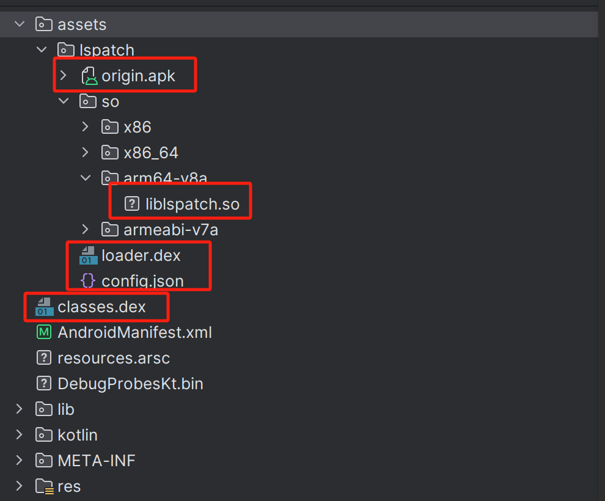

## 一、概述
此文主要为了记录LSPatch中关于重打包相关的逻辑，具体代码位于patch下LSPatch.java


## 二、源码解析

### 2.1 入口

#### 2.1.1 Main方法

```java
public static void main(String... args) throws IOException {
        //构建LSPatch对象，日志打印部分是解耦的，故单独创建并塞入
        LSPatch lspatch = new LSPatch(new JavaLogger(), args);
        if (lspatch.help) {
            lspatch.jCommander.usage();
            return;
        }
        try {
            //核心逻辑，开始执行命令行传入的参数
            lspatch.doCommandLine();
        } catch (PatchError e) {
            e.printStackTrace(System.err);
        }
}
```

#### 2.1.2 doCommandLine
```java
public void doCommandLine() throws PatchError, IOException {
        for (var apk : apkPaths) {
            //根据传入的路径参数构建File对象
            File srcApkFile = new File(apk).getAbsoluteFile();

            String apkFileName = srcApkFile.getName();

            //创建相关的路径
            var outputDir = new File(outputPath);
            outputDir.mkdirs();

            //构建生成对象
            File outputFile = new File(outputDir, String.format(
                    Locale.getDefault(), "%s-%d-lspatched.apk",
                    FilenameUtils.getBaseName(apkFileName),
                    LSPConfig.instance.VERSION_CODE)
            ).getAbsoluteFile();

            //如果已经存在并且没有制定--force ，则报错
            if (outputFile.exists() && !forceOverwrite)
                throw new PatchError(outputPath + " exists. Use --force to overwrite");
            logger.i("Processing " + srcApkFile + " -> " + outputFile);

            //进行重打包
            patch(srcApkFile, outputFile);
        }
}

```

尽量指定--force, 否则每次都要自己删除，要么就需要将苟江生成对象的命名规则改掉，也可以解决这个问题。

### 2.2 打包
#### 2.2.1 操作原文件
整体上使用tyr-resource的方式，将原文件使用ZFile打开并进行操作，并且将原apk写入到重打包后的apk的assets目录
```java
try (var dstZFile = ZFile.openReadWrite(outputFile, Z_FILE_OPTIONS);
             //将原apk写入到重打包后的apk的assets目录，为了后面过签名校验做准备
             var srcZFile = dstZFile.addNestedZip((ignore) -> ORIGINAL_APK_ASSET_PATH, srcApkFile, false)) {
    //具体文件操作
}

//上述代码dstZFile为最终重打包的目标文件，Z_FILE_OPTIONS是相关压缩参数，4096对齐
private static final ZFileOptions Z_FILE_OPTIONS = new ZFileOptions().setAlignmentRule(AlignmentRules.compose(
            AlignmentRules.constantForSuffix(".so", 4096),
            AlignmentRules.constantForSuffix(ORIGINAL_APK_ASSET_PATH, 4096)
    ));
```

#### 2.2.2 处理apk签名
文件重打包后，需要使用我们自定义的签名文件进行重打包。
```java
var keyStore = KeyStore.getInstance(KeyStore.getDefaultType());

//查找在command中指定的签名文件的参数，如果没有，则使用默认assets/keystore路径下的keystore
if (keystoreArgs.get(0) == null) {
    logger.i("Register apk signer with default keystore...");
    try (var is = getClass().getClassLoader().getResourceAsStream("assets/keystore")) {
        keyStore.load(is, keystoreArgs.get(1).toCharArray());
    }
} else {
    logger.i("Register apk signer with custom keystore...");
    try (var is = new FileInputStream(keystoreArgs.get(0))) {
        keyStore.load(is, keystoreArgs.get(1).toCharArray());
    }
}
//获取到原始的签名文件信息
var entry = (KeyStore.PrivateKeyEntry) keyStore.getEntry(keystoreArgs.get(2), new KeyStore.PasswordProtection(keystoreArgs.get(3).toCharArray()));

// 处理签名
// MinSdkVersion:28 因为拉起原apk使用到了AppComponentFactory，此Api是冲Android 9 （即28）开始提供
// 此处并不是直接进行修改，而是注册了一个类似于文件操作监听Listener,会在对文件操作的最后完成修改&重签名
new SigningExtension(SigningOptions.builder()
        .setMinSdkVersion(28)
        .setV2SigningEnabled(true)
        .setCertificates((X509Certificate[]) entry.getCertificateChain())
        .setKey(entry.getPrivateKey())
        .build()).register(dstZFile);

```
由于对原Apk需要进行修改和重签名，绝大部分App对签名都有检验，故此处需要对原Apk内的签名校验进行处理，目前LSPatch过签名校验有两种模式，别分是java层的和Native层的，并没有做svc相关的处理，这部分后续会单独拿出来分析。

#### 2.2.3 处理清单文件
```java
    /**
     * 修改清单文件
     * @param is 原清单文件的输入流
     * @param metadata 自定义需要替换的信息
     * @param minSdkVersion 待修改的最低版本号
     * @return 返回修改完成后的数据
     * @throws IOException
     */
    private byte[] modifyManifestFile(InputStream is, String metadata, int minSdkVersion) throws IOException {
        ModificationProperty property = new ModificationProperty();

        //是否需要覆盖原先的版本号
        if (overrideVersionCode)
            property.addManifestAttribute(new AttributeItem(NodeValue.Manifest.VERSION_CODE, 1));

        //重点*  修改最新版本号到28, 前面有提到过和AppComponentFactory相关，其最低版本号要求是28
        if (minSdkVersion < 28)
            property.addUsesSdkAttribute(new AttributeItem(NodeValue.UsesSDK.MIN_SDK_VERSION, "28"));

        // 修改debuggable状态，这个也是可以配置的
        property.addApplicationAttribute(new AttributeItem(NodeValue.Application.DEBUGGABLE, debuggableFlag));

        // 替换原清单文件中的AppComponentFactory属性，改为org.lsposed.lspatch.metaloader.LSPAppComponentFactoryStub，方便我们注入逻辑
        property.addApplicationAttribute(new AttributeItem("appComponentFactory", PROXY_APP_COMPONENT_FACTORY));

        // 相当于添加一个标识
        property.addMetaData(new ModificationProperty.MetaData("lspatch", metadata));

        //暂时忽略即可，目前的流程没有使用到LSPatch提供的管理器，QUERY_ALL_PACKAGES权限用于可以访问其他安装的包
        if (useManager)
            property.addUsesPermission("android.permission.QUERY_ALL_PACKAGES");

        //完成处理并输出,后续会将其写入到apk文件中
        var os = new ByteArrayOutputStream();
        (new ManifestEditor(is, os, property)).processManifest();
        is.close();
        os.flush();
        os.close();
        return os.toByteArray();
    }
```

#### 2.2.4 LSPatch配件文件写入
```java

//将一些状态值写入到文件中，设计是否使用LSPatch的manager工具，debuggable状态，覆盖版本号，过签名校验的级别，原始的签名信息，原AppComponentFactory
final var config = new PatchConfig(useManager, debuggableFlag, overrideVersionCode, sigbypassLevel, originalSignature, appComponentFactory);
final var configBytes = new Gson().toJson(config).getBytes(StandardCharsets.UTF_8);

//省略...

//将文件写入到assets/lspatch/config.json
try (var is = new ByteArrayInputStream(configBytes)) {
    dstZFile.add(CONFIG_ASSET_PATH, is);
} catch (Throwable e) {
    throw new PatchError("Error when saving config");
}
```


#### 2.2.5 注入metaloader.dex
前面将清单文件中的AppComponentFactory替换了自定义的AppComponentFactory，故需要将这个类注入到apk中。
metaloader.dex内部就是包含org.lsposed.lspatch.metaloader.LSPAppComponentFactoryStub以及一些处理Hide Api相关的代码。
```java
logger.i("Adding metaloader dex...");
try (var is = getClass().getClassLoader().getResourceAsStream(Constants.META_LOADER_DEX_ASSET_PATH)) {
    dstZFile.add("classes.dex", is);
} catch (Throwable e) {
    throw new PatchError("Error when adding dex", e);
}
```


#### 2.2.5 注入LSpatch相关内容
包含loader.dex & 各架构的liblspatch.so，用于加载我们写的类Xposed的模块。
```java
logger.i("Adding loader dex...");
try (var is = getClass().getClassLoader().getResourceAsStream(LOADER_DEX_ASSET_PATH)) {
    dstZFile.add(LOADER_DEX_ASSET_PATH, is);
} catch (Throwable e) {
    throw new PatchError("Error when adding assets", e);
}

logger.i("Adding native lib...");
// copy so and dex files into the unzipped apk
// do not put liblspatch.so into apk!lib because x86 native bridge causes crash
for (String arch : ARCHES) {
    String entryName = "assets/lspatch/so/" + arch + "/liblspatch.so";
    try (var is = getClass().getClassLoader().getResourceAsStream(entryName)) {
        dstZFile.add(entryName, is, false); // no compress for so
    } catch (Throwable e) {
        // More exception info
        throw new PatchError("Error when adding native lib", e);
    }
    logger.d("added " + entryName);
}
```

#### 2.2.6 注入Xposed模块
将Xposed模块预埋到assets/lspatch/modules/目录下，如果为了方便，临时将代码写入到metaloader.dex中也可以的。
```java
private void embedModules(ZFile zFile) {
    for (var module : modules) {
        File file = new File(module);
        try (var apk = ZFile.openReadOnly(new File(module));
            var fileIs = new FileInputStream(file);
            var xmlIs = Objects.requireNonNull(apk.get(ANDROID_MANIFEST_XML)).open()
        ) {
            //获取Xposed模块包名并预埋
            var manifest = Objects.requireNonNull(ManifestParser.parseManifestFile(xmlIs));
            var packageName = manifest.packageName;
            logger.i("  - " + packageName);
            zFile.add(EMBEDDED_MODULES_ASSET_PATH + packageName + ".apk", fileIs);
        } catch (NullPointerException | IOException e) {
            logger.e(module + " does not exist or is not a valid apk file.");
        }
    }
}
```


#### 2.2.7 最终产物



### 2.3 AppComponentFactory
在重打包过程中，有很重要的一步就是将清单文件中的AppComponentFactory替换成自定义的LSPAppComponentFactoryStub。下面我们来详细了解一下AppComponentFactory以及LSPAppComponentFactoryStub中具体做了什么内容。
在Android应用开发中，AppComponentFactory 是 Android 9 (API 级别 28) 引入的一个类，用于控制应用组件的实例化过程。
- instantiateActivity(): 用于实例化Activity。
- instantiateService(): 用于实例化Service。
- instantiateReceiver(): 用于实例化BroadcastReceiver。
- instantiateProvider(): 用于实例化ContentProvider。

在App的启动流程中，LoadApk对象会先根据清单文件中的信息创建AppComponentFactory，再由其创建Application并进行Attach，也就意味着这个代码执行时机比Application相关内容更早。方便我们在中间做一些加载插件、加载外部so等行为。

LSPAppComponentFactoryStub核心就是将与进程架构适配的liblspatch.so加载起来,下面是其部分核心代码：
```java

//useManager是从之前预置在asset目录下的config.json中读取的，用于标识是否是使用LSPatch的管理器应用。
if (useManager) {
    //如果是使用管理器，则需要将管理器中的loader.dex读到内存中，供后续liblspatch.so加载使用
    //除了loader.dex外，还需要单独将管理器中的liblspatch.so路径进行记录。
    Log.i(TAG, "Bootstrap loader from manager");
    var ipm = IPackageManager.Stub.asInterface(ServiceManager.getService("package"));
    ApplicationInfo manager;
    if (Build.VERSION.SDK_INT >= Build.VERSION_CODES.TIRAMISU) {
        manager = (ApplicationInfo) HiddenApiBypass.invoke(IPackageManager.class, ipm, "getApplicationInfo", Constants.MANAGER_PACKAGE_NAME, 0L, Process.myUid() / 100000);
    } else {
        manager = ipm.getApplicationInfo(Constants.MANAGER_PACKAGE_NAME, 0, Process.myUid() / 100000);
    }
    try (var zip = new ZipFile(new File(manager.sourceDir));
        var is = zip.getInputStream(zip.getEntry(Constants.LOADER_DEX_ASSET_PATH));
        var os = new ByteArrayOutputStream()) {
            transfer(is, os);
            dex = os.toByteArray();
        }
        soPath = manager.sourceDir + "!/assets/lspatch/so/" + libName + "/liblspatch.so";
} else {
    //如果不是使用管理器，则将内置到重打包apk中的相关文件读出来。
    Log.i(TAG, "Bootstrap loader from embedment");
    try (var is = cl.getResourceAsStream(Constants.LOADER_DEX_ASSET_PATH);
        var os = new ByteArrayOutputStream()) {
        transfer(is, os);
        dex = os.toByteArray();
    }
    soPath = cl.getResource("assets/lspatch/so/" + libName + "/liblspatch.so").getPath().substring(5);
}

//加载liblspatch.so
System.load(soPath);
```