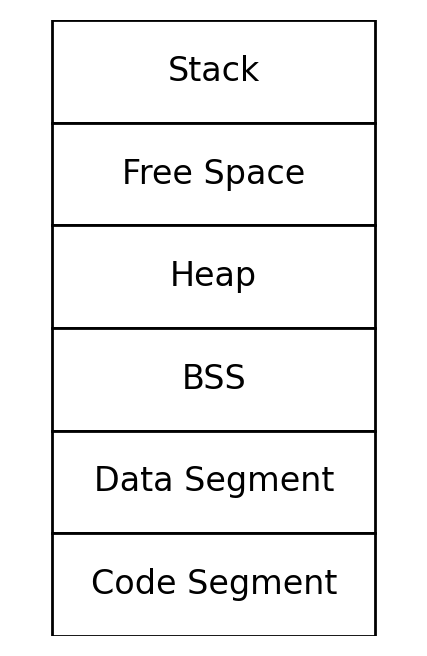

## 一、基本概念
大家在日常开发过程中，是否思考过一个问题，为什么手机可用内存远远大于手机的物理内存?   
带着这个问题来了解下述内容。

### 1.1 物理内存
在购买手机的时候，手机的内存大小是核心性能参数，它极大的影响了手机的速度与稳定性。这个参数就对应着物理内存，它是一个实实在在的物理设备（也可以参考电脑的内存条）。

内存是由多个连续的单元组成，每个单元被定义为一个字节，每个字节都配有唯一的物理地址，这些地址都是从0开始连续编码的。因此，如果手机上配有4G的内存，则其物理内存的空间范围可以从0延展到4GB。

在最早的计算机程序开发过程中，程序猿都是直接操作物理内存的，每个数据存在具体的什么位置，都需要程序猿自己负责。这就带来了几个问题：

- 复杂性：直接操作物理内存要求程序员精确地管理每一个内存地址，这不仅增加了编程的复杂性，也提高了出错的风险。程序员需要处理内存分配、地址计算等低级任务，分散了注意力，无法专注于程序的逻辑和功能开发。

- 安全性：所有程序共享同一个物理内存环境，不小心将数据写入到其他程序的内存中，可能造成崩溃。在这种情况下，也容易造成恶意程序可能可以访问其他程序的数据，造成数据泄漏。

- 拓展性：程序移植成本高，随着硬件的变化，程序可以需要重写或者是大幅度修改才能在新硬件上运行。
  
- 其他：在这种情况下，内存是无法被动态共享或者是按需分配的，资源利用率低，内存碎片问题处理复杂。


既然有这么多那么问题，该如何进行解决呢？你可以直接回答虚拟内存，但是这中间还有一个重要的概念，局部性原理。

### 1.2 局部性原理
局部性原理支出，在短时间内，程序执行倾向于只访问相对集中的内存区域。局部性通常有两种形式：
- 时间局部性：如果一个内存位置在某一时刻被访问，那么它在近期内很可能再次被访问。
- 空间局部性：如果一个内存位置被访问，那么附近的内存位置接下来也有很大的可能性被访问。因此，操作系统会预加载这些临济的数据到物理内存中，减少接下来数据加载的时间。

局部性原理揭示了一个重要的洞见：即对于内存需求巨大的程序，在任何给定的时刻，实际需要的物理内存是有限的。这为虚拟内存的设计提供你改了理论基础。

### 1.3 虚拟内存
在计算机科学中，有一句著名的格言：“任何问题都可以通过增加一个间接的中间层来解决。”虚拟内存正是这种思想的实践例证。它创建了一个抽象层，使每个程序都认为自己拥有一个连续且几乎无限大的内存空间（此处以64位系统为例），这个空间远大于实际物理内存的容量。这种抽象实现了以下几个目标：
- 内存隔离：虚拟内存为每个进程提供了独立的地址空间，增强了进程之间的安全和隔离。这意味着即使多个程序同时运行，它们也不会干扰到彼此的内存空间
- 内存管理的简化：程序员无需关心物理内存的实际限制或其它进程的内存使用情况，可以更专注于程序的开发。
- 资源的有效利用：通过按需分配物理内存，虚拟内存可以更有效地使用有限的物理资源。只有当数据真正需要时，它才被加载到物理内存中。
- 灵活性：虚拟内存使得操作系统能够控制哪些内存页需要保留在物理内存中，哪些可以暂时存放到磁盘上的交换空间（swap space）。这个交换空间允许系统在物理内存满载时，将不活跃的页面移出到硬盘，从而为活跃进程腾出空间。当这些被交换出的页面再次需要访问时，它们可以被重新加载回物理内存。

### 1.4 小结
虚拟内存让程序开发更加简单，增强了系统的安全性和灵活性，并且使得即使物理内存不够大，系统仍然可以支持运行大型应用程序。这也是前文提到的为什么手机的可用内存可以远远大于其物理内存的原因。


## 二、内存布局
在上面介绍了虚拟内存的由来后，接下来了解一下进程内部的虚拟内存布局，或者说虚拟内存是如何安排各种数据的。

上图是一个简易的内存布局，主要包含如下几块内容
- 代码段：代码被编译后形成的机器码
- 数据段：代码一般会操作数据，对于有初值的变量，它的初始值会存放在文件中，这部分就是数据段（已经初始化且不为0的全局变量&静态变量）
- BSS段：未初始化的全局变量和静态变量，因为都没有初始化，故初始值都是0，仅需要记录他们的大小即可。
- 栈&堆：在程序运行中进行申请，在程序结束后释放。栈是被安排在内存高地址处，向下增长。堆是安排在低地址处，向上增长。
- 待分配空间：在栈和堆之间的就是待分配的空间。

除了上述这些基本区域外，海有一些其他的内存区域，主要包含一下几部分
- 共享内存段：通过系统调用映射一块内存区域作为共享内存，用来进行进程通讯。
- 内存映射文件：可以将磁盘文件映射到内存中，用于文件编辑或者是进程通讯。
- 加载共享库的内存空间：程序依赖了其他的共享库，则其对应的数据也会加载到进程的地址空间中。

## 三、堆内存申请
在日常开发过程中，堆内存的申请是一个常见的操作。例如，我们可以通过调用 malloc 函数来申请一块内存。那么，这个过程的实现细节究竟是怎样的呢？继续阅读下文，我们将深入探讨堆内存的申请。

在操作系统内核中，一直维持了一个变量brk,指向堆的顶部，故brk的位置实际上就决定了堆的大小。Linux底层有两个方法帮助我们申请堆内存，分别是mmap和sbrk。

### 3.1 sbrk
其定义如下：
```cpp
#include <unistd.h>

/**
 * sbrk方法通过改变brk变量来改变堆的容量
 * param:incr 正负值皆可，对应着增删堆内存大小
 * return:void* 成功 返回brk的历史值，失败 -1
 **/
void* sbrk(intptr_t incr); 
```
在日常开发中，我们一般不会使用sbrk来申请堆内存，而是使用之前提到过的malloc方法。malloc内部可能走到sbrk方法（malloc属于libc提供的方法，并非系统方法）。

### 3.2 mmap
调用mmap申请堆内存
```cpp
#include <unisted.h>
#include <sys/mman.h>

/**
 * addr:该区的起始地址
 * length:长度
 * prot:内存访问权限，包含可读、可写、可执行、不可访问
 * flag：类型，核心的有MAP_SHARED、MAP_PRIVATE、MAP_ANONYMOUS
 * fd：文件描述符
 * offset:文件内的偏移值
 */
void* mmap(void *addr,size_t length,int prot,int flags,int fd,off_t offset);
```
关于flag，再消息描述一下
- MAP_SHARED：共享内存映射区域，多进程映射同一块内存，用于通讯。
- MAP_PRIVATE:私有内存映射区域，对同一文件进行映射，多进程有不同的副本。
- MAP_ANONYMOUS:匿名内存映射，fd不能有值。

下面是一个简单的demo，使用mmap完成进程间通讯。
```cpp
#include <sys/mman.h>
#include <stdlib.h>
#include <stdio.h>
#include <unistd.h>

int main() {
    pid_t pid;

    char* shm = (char*)mmap(0, 4096, PROT_READ | PROT_WRITE,
        MAP_SHARED | MAP_ANONYMOUS, -1, 0);

    if (!(pid = fork())){
        sleep(1);
        printf("child: %s\n", shm);
        sprintf(shm, "%s", "321321331");
        exit(0);
    }
  
    sprintf(shm, "%s", "123123113");
    sleep(2);
    printf("parent: %s\n", shm);

    return 0;
}
```
得到的效果应该是
```bash
child:123123113
parent:321321331
```


## 四、链接

在第二节有介绍内部的基础布局，这些内存段通过编译和链接被组织到一起，最终生成可执行文件。这一过程又分为静态链接和动态链接

- 静态链接：将程序的所有代码和库在编译的时候链接在一起的方式。
- 动态链接：在二进制加载到内存时（或者是运行的时候），将其中的符号（调用方法或参数）解析成真实的地址。
  

### 4.1 静态链接

静态链接在编译时将所有必要的库函数和程序代码合并成一个单一的文件。这个过程中，编译器和链接器会完成符号解析和地址绑定，将所有引用的符号解析为具体的内存地址，并将所有目标文件中的代码段和数据段合并，生成最终的可执行文件。

一般分为两步

- 第一步：连接系需要对编译器生成的多个目标(.o)文件进行合并，一般采取的策略是相似的段合并，最终生成共享库文件.so或可执行文件。
- 第二步：连接器会对整个文件在进行第二遍扫描。利用第一步得到的符号表信息，一次对文件中符号引用的地方进行地址替换。也就是重定位。


通过静态链接生成的可执行文件包含了所有运行时所需的代码和数据，因此在不同系统上运行时，不需要依赖外部库。这种方式提高了程序的独立性和兼容性，但也可能导致可执行文件的体积增大。


### 4.2 动态链接
在静态链接中，所有必要的库函数和程序代码在编译时被合并到一个独立的可执行文件中。这种方法虽然简化了程序的部署和运行，但也存在一些问题，例如：
- 1、文件大小：静态链接的可执行文件包含所有的库函数，导致体积比较大。
- 2、内存浪费：多个静态链接的程序如果使用相同的库函数，每个程序都会有一份库函数的副本，导致内存浪费。
- 3、更新复杂：如果库函数有更新，需要重新编译和分发整个可执行文件，而不是简单地更新库文件。

为了克服这些问题，动态链接提供了更灵活和高效的解决方案。

动态链接在程序运行时加载所需的库函数，而不是在编译时将它们包含在可执行文件中。**动态链接的主要特点**包括：
- 共享库：多个程序可以共享同一个库文件，从而节省内存和存储空间。
- 较小的可执行文件：动态链接的可执行文件只包含程序自身的代码，库函数在运行时动态加载，因此文件体积较小。
- 易于更新：库函数的更新可以通过替换库文件来实现，而无需重新编译和分发整个程序。

**基本实现过程：**
- 1、编译：编译器将源代码编译成目标文件（.o 文件），但不将库函数链接进来。
- 2、链接：链接器生成一个包含动态链接信息的可执行文件，指明所需的动态库。
- 3、加载：程序运行时，操作系统的动态链接器（如 Linux 的 ld.so）会加载所需的动态库，将库函数链接到程序中。

## 五、页中断&fork写时复制
在前面介绍mmap的时候，写了一段通过fork进程操作mmap进行进程间通讯的例子。这里带来一个小问题，就是父子进程之间可以访问共有的变量，并且可以独自修改，这个是如何做到的呢？

其背后是页中断在进行支持。
页中断是写时复制机制的核心，它确保只有在需要修改数据时才进行实际的物理页复制，从而提高内存利用效率。

**写时复制触发页中断的过程：**
- 1、初始状态：父进程和子进程共享同一物理页，页表项标记为只读。
- 2、触发页中断：当其中一个进程尝试写入只读页时，CPU检测到写入操作，产生页中断。
- 3、处理页中断：
    - 保存上下文：操作系统保存当前进程的上下文信息。
    - 检查写时复制：操作系统检查页表，确认这是一个写时复制页中断。
    - 分配新页：操作系统分配一个新的物理页，并将原页的数据复制到新页。
    - 更新页表：操作系统更新进程的页表，将写操作重定向到新的物理页，同时将新页标记为可写。
- 4、恢复执行：操作系统恢复进程的上下文信息，继续执行导致页中断的指令。
  

页中断和写时复制是提高内存管理效率的重要机制。通过在fork系统调用中使用写时复制，操作系统能够延迟实际的物理页复制，直到进程试图修改共享内存页。这种复制策略依赖于页中断机制，在需要时分配新页并复制数据，从而实现高效的内存利用和进程创建。