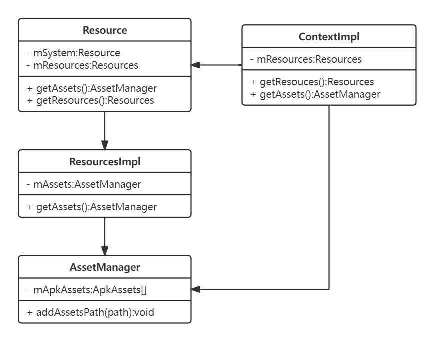

## 一、基本概念
### 1.1 AAPT
AAPT是Android SDK中的一个工具，用于处理应用资源并生成可以打包到APK中的二进制文件。其在构建过程中起着直观重要的作用，不仅可以编译资源，还可以为资源分配ID，并生成R.java文件。

源码路径 /frameworks/base/tools/aapt/

从AAPT工具编译资源的过程可知，aapt工具会编译assets、res和AndroidManifest.xml这三类资源。这里我们主要来看前两者。
- assets:这类资源放在工程的根目录assets下。里面存放的是一些原始文件，比如音频文件，MP4等。这类文件会原封不动的打包进apk中，不会进行压缩，同时其也不会生成Resource ID，如果要访问这类资源，需要通过AssetManager来获得，比如
```java
AssetManager asset = getAssets();
InputStream is = asset.open("文件名");
```
assets类资源文件与杰西莱要介绍的res目录下的资源的区别在于，后者是通过Resource获得，并且编译后会生成Resource id.

- res:这类资源放在源代码工程res目录下，此目录可以放很多种资源，除了res/raw目录下的资源外，其他的都会编译或处理。raw目录下的处理方式和asset处理方式类似，也是不做处理的打进apk中，不过此处会生成Resource id。日常开发，可以铜鼓Resource id来查找资源，比如
```java
Resource resource = getResource();
resource.getString(R.string.test);
```

### 1.2 Resource id
Resource id是一个整数值，经过aapt编译后生成R.java文件，同时生成资源索引表resourcr.arsc,该文件也是一个二进制格式的文件，程序运行的时候根据R.java中的Resource id去resource.arsc中查找相关的资源。
查找分为两种情况
- 文件：如果查找的是文件，resource.arsc中保存的是文件名称
- 资源：arsc是存储的是资源的值，比如字符串，那么resource.arsc中保存的是字符串内容

Resource id和resource.arsc的配合，加快了Android查找资源的速度。为了更好地查找与区分资源，Resource id其格式上也做了设计

**0xaabbcccc**
- aa:最高字节用于区分是系统资源还是应用资源，日常开发中这里看到的一般是7f,标识应用资源，系统资源编码是01
- bb:用于表示当前资源的类型，比如02代表id,03代表style,04代表string等等
- cccc:当前资源的序列号

## 二、初始化
资源初始化过程中涉及到三个重要的类，分别是Context,Resource和AssetManager。
日常开发过程中，一般使用Context来获取Resource和AssetManager对象，实际上，如果Resrouce类访问的是资源文件，它也是通过AssetManager类来访问的，不过在访问之前，会先根据Resource id先查找到对应的资源文件名(例如加载Layout文件)。
整体关系图，如下。


### 2.1 AssetManager
由于Resource的构建需要先创建AssetManager,故此处我们先看AssetMananger初始化的过程，AssetManager有专门用于构建的Builder，初始化还涉及Native代码。

#### 2.1.1 AssetManager.Builder
代码位置：frameworks/base/core/java/android/content/res/AssetManager.java
```java
    /**
     * AssetManager.Builder类用于构建AssetManager实例
     * 核心能力：
     *  1、添加APK资源（ApkAssets）：允许开发者添加单个或多个Apk文件资源。
     *  2、添加资源管理器：这个是Android11之后才添加的，允许开发者添加资源管理器，可以用于后置资源加载
     * */
    public static class Builder {
        private ArrayList<ApkAssets> mUserApkAssets = new ArrayList<>();
        private ArrayList<ResourcesLoader> mLoaders = new ArrayList<>();

        public Builder addApkAssets(ApkAssets apkAssets) {
            mUserApkAssets.add(apkAssets);
            return this;
        }

        public Builder addLoader(ResourcesLoader loader) {
            mLoaders.add(loader);
            return this;
        }

        public AssetManager build() {
            //获取系统已经存在的Assets
            final ApkAssets[] systemApkAssets = getSystem().getApkAssets();

            //资源去重与排序，确保通过加载器添加的资源不重复，并按最后添加的顺序来确定资源的加载顺序。
            final ArrayList<ApkAssets> loaderApkAssets = new ArrayList<>();
            final ArraySet<ApkAssets> uniqueLoaderApkAssets = new ArraySet<>();
            for (int i = mLoaders.size() - 1; i >= 0; i--) {
                final List<ApkAssets> currentLoaderApkAssets = mLoaders.get(i).getApkAssets();
                for (int j = currentLoaderApkAssets.size() - 1; j >= 0; j--) {
                    final ApkAssets apkAssets = currentLoaderApkAssets.get(j);
                    if (uniqueLoaderApkAssets.add(apkAssets)) {
                        loaderApkAssets.add(0, apkAssets);
                    }
                }
            }

            //资源数组构建： 将系统资源、用户添加的资源和加载器资源合并到一个数组中，这个数组将用于创建 AssetManager。
            final int totalApkAssetCount = systemApkAssets.length + mUserApkAssets.size()
                    + loaderApkAssets.size();
            final ApkAssets[] apkAssets = new ApkAssets[totalApkAssetCount];

            System.arraycopy(systemApkAssets, 0, apkAssets, 0, systemApkAssets.length);

            // Append user ApkAssets after system ApkAssets.
            for (int i = 0, n = mUserApkAssets.size(); i < n; i++) {
                apkAssets[i + systemApkAssets.length] = mUserApkAssets.get(i);
            }

            // Append ApkAssets provided by loaders to the end.
            for (int i = 0, n = loaderApkAssets.size(); i < n; i++) {
                apkAssets[i + systemApkAssets.length  + mUserApkAssets.size()] =
                        loaderApkAssets.get(i);
            }

            //创建 AssetManager 实例： 使用私有构造函数（AssetManager(boolean sentinel)）创建 AssetManager，这个构造函数不会自动创建系统资源，因为已经在构建器中处理了。
            final AssetManager assetManager = new AssetManager(false /*sentinel*/);
            assetManager.mApkAssets = apkAssets;
            //native中set资源属性
            AssetManager.nativeSetApkAssets(assetManager.mObject, apkAssets,
                    false /*invalidateCaches*/);
            assetManager.mLoaders = mLoaders.isEmpty() ? null
                    : mLoaders.toArray(new ResourcesLoader[0]);

            return assetManager;
        }
    }

    /**
     * 带参构造方法，非带参的构造内部会构建系统资源
     * */
    @SuppressWarnings("unused")
    private AssetManager(boolean sentinel) {
        mObject = nativeCreate();
        if (DEBUG_REFS) {
            mNumRefs = 0;
            incRefsLocked(hashCode());
        }
    }
```
接下来核心逻辑看两处，nativeCreate() & nativeSetApkAssets()

#### 2.1.2 nativeCreate()
代码位置：frameworks/base/core/jni/android_util_AssetManager.cpp
```cpp
static jlong NativeCreate(JNIEnv* /*env*/, jclass /*clazz*/) {
  return reinterpret_cast<jlong>(new GuardedAssetManager());
}

struct GuardedAssetManager : public ::AAssetManager {
  Guarded<AssetManager2> guarded_assetmanager;
};
```
从上述代码可以看起其核心逻辑是在AssetManager2中

#### 2.1.3 AssetManager2
代码位置：frameworks/base/libs/androidfw/include/androidfw/AssetManager2.h
```cpp
/**
 * 这是一份我删减过的AssetManager2，保留了核心的方法和属性
 **/
class AssetManager2 {
public:
    // 使用智能指针来管理资源和配置
    using ApkAssetsPtr = std::shared_ptr<const ApkAssets>;

    // 构造函数
    AssetManager2();
    explicit AssetManager2(std::vector<ApkAssetsPtr> apk_assets, ResTable_config config);

    // 资源管理方法
    bool SetApkAssets(const std::vector<ApkAssetsPtr>& apk_assets, bool invalidate_caches = true);
    const ApkAssetsPtr& GetApkAssets(size_t index) const;
    size_t GetApkAssetsCount() const;

    // 资源获取方法
    std::unique_ptr<Asset> Open(const std::string& filename, Asset::AccessMode mode) const;
    std::unique_ptr<AssetDir> OpenDir(const std alignas alignas:1px; std::string& dirname) const;

    // 资源配置管理
    void SetConfigurations(std::vector<ResTable_config> configurations);

private:
    // 管理 APK 资产列表
    std::vector<ApkAssetsPtr> apk_assets_;

    // 当前资源配置
    std::vector<ResTable_config> configurations_;

    // 动态引用表
    std::shared_ptr<DynamicRefTable> dynamic_ref_table_;
};
```
可以看到日常操作资源的很多核心方法，比如open，其实现都是在AssetManager中
#### 2.1.4 nativeSetApkAssets()


### 2.2 Resource
## 三、资源查找
### 3.1 文件查找
### 3.2 非文件查找
## 四、插件化中资源加载的处理
### 4.1 插件Resource处理
### 4.2 资源id冲突


