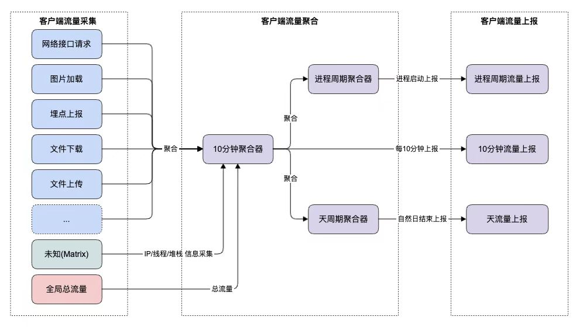

## 一、背景
流量监控是APM建设中最要的一项，但在实际中也是最容易被忽视的，比如 不必要的网络请求、未合理使用网络缓存的资源、逐渐增多的后置资源、第三方SDK流量消耗等，针对这些场景客户端都需要建立对应的监控。

## 二、目标

- 线上整体流量使用情况的大盘建设
    - 每10分钟、单次进程以及单天使用流量的均值、P95、p99、档位分布、每10分钟使用流量（TPM）的大盘建设
    - 大盘需要区分上行/下行、wifi/移动网络、前台/后台、功能模块（网络、图片库、webview等）、业务Bundle信息、技术栈、标识资源的唯一特征（图片url/接口url等）维度统计
- 流量异常
    - 每10分钟、单次进行或者当天流量达到异常档位时，在hubble异常分析中可以查询
    - 异常买点数据需可包含上行/下行、wifi/移动网络、前台/后台、功能模块（图片加载、网络库等）、业务Bundle信息、技术栈、标识资源的唯一特征（图片url/接口url等）维度统计
    - 在异常发生时，为了便于问题排查，埋点还可以携带扩展细腻，比如资源访问次数、线程、堆栈、网络资源IP、页面等信息


## 三、采集方案



- 单次进程流量：在app启动后上报上次App使用进程的信息，metric-tags-type:process

- 天流量：在app启动或者是0点时上报上个自然日的流量信息，metric-tags-type:daily

- 10分钟流量：app运行每10分钟上报一次流量信息，周期性聚合器每10分钟聚合统计完整数据后上报，具体埋点格式详见后方 metric-tags-type:periodic
    - 考虑到10分钟上报数量会比较大，所以线上不必全量上报（灰度40%）
    - 如果10分钟流量超200M或者连续3个10分钟超过50M,即使没有命中灰度，也会上报


#### 3.1 总流量
- 基于系统TrafficStats采集 总流量/上行/下行/前台/后台 流量
- 基于系统NetworkStatsManager 采集wifi/mobile 流量信息。 注：android6.0以下无法使用，所以wifi/mobile流量信息只有6.0及以上才能上报


<details>
<summary>全局总流量埋点字段</summary>

| 指标 | 字段 | 说明 |
|-------|-------|-------|
| app.trafic |  | 全局总流量 |
|   | metric-value | 总流量 |
|   | metric-sections-duration | 监控时长
|   | metric-sections-TPM | 每10分钟的流量
|   | metric-sections-FG/BG | 区分 前后台 总流量 FG:前台 BG:后台
|   | metric-sections-TX/RX | 区分 上行/上行 总流量 TX:上行 RX：下行
|   | metric-sections-wifi/mobile | 区分 wifi/移动数据 总流量
|   | metric-sections-cargo/user | 区分 业务bundle 总流量
|   | metric-sections-h5/thresh/native | 区分技术栈总流量
|   | metric--tags-sdk_ver | 区分sdk版本号，第一个版本1
|   | attrs-formatted_traffic   | 用于展示的流量，如 10MB、10KB、10B
|   | ext-MatrixTraffic | android线程维度流量信息
|   
</details>

</br>


#### 3.2 网络接口请求流量信息
- 基于OkHttp EventListener的方法 requestHeadersEnd/requestBodyEnd/responseHeadersEnd/responseBodyEnd 来监控网络请求的流量
- 考虑接口url过多，以原始接口url做维度聚合统计可能数据太大，所以网络接口请求策略为 域名+serverApp(path第一段)，如https://xxx/xxx
- 在网络请求埋点(app.network)中添加了名为traffic的secion用于上报单次网络请求的流量信息

<details>
    <summary>网络接口请求流量信息埋点字段</summary>

| 指标 | 字段 | 说明 |
|-------|-------|-------|
| app.network.trafic |  | 网络接口请求流量 
|   | metric-value | 总流量 
|   | metric-sections-duration | 监控时长
|   | metric-sections-cargo/user | 区分 业务bundle 总流量
|   | metric-sections-h5/thresh/native | 区分技术栈总流量
|   | metric-sections-https://xxx   | 区分接口url的总量，聚合策略：域名+serverApp(path第一段)，如https://xxx/xxx
|   | metirc-sections-QPM-https://xxx | 接口10分钟的请求次数，聚合策略：同上
|   | ext-trafficIds | 区分接口url的总流量，取值如果太多对section统计有影响，开关控制可降级为ext参数
|   | ext-trafficQPM | 接口每10分钟的请求次数，取值如果太多对section统计有影响，开关控制可降级为ext参数
|   | attrs-formatted_traffic   | 用于展示的流量，如 10MB、10KB、10B
|   | ext-MatrixTraffic | android线程维度流量信息
|   
</details>

</br>

#### 3.3 图片请求流量信息
- 基于ImageLoader库，在图片加载时给RequestBuilder设置RequestListener,在RequestListener的onResourceReady中监控图片加载行为
- 图片url同样太多，不同直接使用图片url做聚合，聚合策略为 域名+path前两段，如 https://xxx/xxx/xxx

<details>
    <summary>图片请求流量信息埋点字段</summary>

| 指标 | 字段 | 说明 |
|-------|-------|-------|
| app.image.trafic |  | 网络接口请求流量 
|   | metric-value | 总流量 
|   | metric-sections-duration | 监控时长
|   | metric-sections-cargo/user | 区分 业务bundle 总流量
|   | metric-sections-h5/thresh/native | 区分技术栈总流量
|   | metric-sections-https://xxx   | 区分接口url的总量，聚合策略：域名+serverApp(path第一段)，如https://xxx/xxx
|   | metirc-sections-QPM-https://xxx | 接口10分钟的请求次数，聚合策略：同上
|   | ext-trafficIds | 区分接口url的总流量，取值如果太多对section统计有影响，开关控制可降级为ext参数
|   | ext-trafficQPM | 接口每10分钟的请求次数，取值如果太多对section统计有影响，开关控制可降级为ext参数
|   | attrs-formatted_traffic   | 用于展示的流量，如 10MB、10KB、10B
|   | ext-MatrixTraffic | android线程维度流量信息
|   
</details>

</br>

#### 3.4 下载流量信息
- 基于okdownload DownloadListener的taskEnd方法中监控下载的流量，注：目前仅收集了文件大小
- 聚合策略为 域名+文件后缀名

<details>
    <summary>下载流量信息埋点字段</summary>

| 指标 | 字段 | 说明 |
|-------|-------|-------|
| app.download.trafic |  | 网络接口请求流量 
|   | metric-value | 总流量 
|   | metric-sections-duration | 监控时长
|   | metric-sections-h5/thresh/native | 区分技术栈总流量
|   | metric-sections-https://xxx   | 区分资源url的总量，聚合策略：域名+后缀（取不到unknow）
|   | metirc-sections-QPM-https://xxx | 资源10分钟的下载次数，聚合策略：同上
|   | ext-trafficIds | 区分资源url的总流量，取值如果太多对section统计有影响，开关控制可降级为ext参数
|   | ext-trafficQPM | 资源每10分钟的请求次数，取值如果太多对section统计有影响，开关控制可降级为ext参数
|   | attrs-formatted_traffic   | 用于展示的流量，如 10MB、10KB、10B
|   | metric--tags-sdk_ver | 区分sdk版本号，第一个版本1
|   | ext-MatrixTraffic | android线程维度流量信息
|   
</details>

</br>

#### 3.5 上传流量信息
- 基于oss/obs 上传功能的回调监控文件上传的流量，注：目前只收集了文件大小
- 聚合策略oss/bss + bizType

<details>
    <summary>上传流量信息埋点字段</summary>

| 指标 | 字段 | 说明 |
|-------|-------|-------|
| app.upload.trafic |  | 上传流量信息
|   | metric-value | 总流量 
|   | metric-sections-duration | 监控时长
|   | metric-sections-h5/thresh/native | 区分技术栈总流量，觉策略 obs/oss + biz_type
|   | metric-sections-ymm-log-upload/user-pub   | 区分业务桶的总流量，聚合策略：同上
|   | metirc-sections-QPM-ymm-log-upload/user-pub | 业务桶每10分钟的上传次数，聚合策略：同上
|   | ext-trafficIds | 区分业务桶的总流量，取值如果太多对section统计有影响，开关控制可降级为ext参数
|   | ext-trafficQPM | 业务桶每10分钟的上传次数，取值如果太多对section统计有影响，开关控制可降级为ext参数
|   | attrs-formatted_traffic   | 用于展示的流量，如 10MB、10KB、10B
|   | metric--tags-sdk_ver | 区分sdk版本号，第一个版本1
|   
</details>

#### 3.6 埋点上报流量信息

<details>
    <summary>埋点上报流量信息字段</summary>

| 指标 | 字段 | 说明 |
|-------|-------|-------|
| app.log.trafic |  | 埋点上报
|   | metric-value | 总流量 
|   | metric-sections-duration | 监控时间
</details>


#### 3.7 单次访问流量
部分功能场景在排查流量问题时需要查看单次访问的流量信息

<details>
    <summary>单次访问流量埋点字段</summary>

| 指标 | 字段 | 说明 |
|-------|-------|-------|
| app.network |  | 网络接口请求
|   | metric-sections-traffic | 接口请求所耗流量
|

| 指标 | 字段 | 说明 |
|-------|-------|-------|
| download |  | 下载
|   | metric-sections-traffic | 下载所耗流量
|

| 指标 | 字段 | 说明 |
|-------|-------|-------|
| upload |  | 上传
|   | metric-sections-traffic | 上传所耗流量
|

</details>

#### 3.8 拓展功能模块
后续可以拓展其他功能模块流量监控的实现，并上报给流量监控框架：比如长连接等


## 四、代码接口层设计

### 4.1、单次流量消耗上报

功能模块每产生一次流量消耗时，直接交由流量监控框架聚合上报（构造对象，传给框架）

```java
/**
 * 单次流量消耗
 */
public class TrafficInfo {
    /**
     * 单次流量消耗的唯一标识，比如：网络接口url
     * 注：流量会以此id维度统计计算，需保证此id的取值尽量少，
     */
    public String id;
    /**
     * 功能模块，image/log/network/download/upload 等
     */
    public String type;
    /**
     * 总流量，单位 B
     */
    public long totalTraffic = -1;
    /**
     * 下行流量，单位 B
     */
    public long rxTraffic = -1;
    /**
     * 上行流量，单位 B
     */
    public long txTraffic = -1;
    /**
     * thresh/h5/rn/plugin 的 bundle name，未知或则其他则不传
     */
    public String bundleName;
    /**
     * thresh/h5/native/plugin
     */
    public String bundleType;
    /**
     * 附加属性维度，会体现在流量埋点的分段里面
     */
    public List<String> attrs;

    public TrafficInfo(String type, long totalTraffic) {
        this.type = type;
        this.totalTraffic = totalTraffic;
    }
}
```
### 4.2 聚合上报
自定义聚合器，并注册到流量框架，自身完成流量计算，流量框架会周期性的聚合所有聚合器的流量

```java
public interface ITrafficAggregator {
    ...

    /**
     * 此聚合器在被周期性聚合前会触发此方法，自定义聚合器可在此方法内做周期性的汇总计算
     */
    default void summarize() {
    }

    /**
     * 流量聚合
     * @param trafficInfo
     */
    void aggregate(TrafficInfo trafficInfo);

    /**
     * 聚合器聚合
     * @param aggregator
     */
    void merge(ITrafficAggregator aggregator);

    /**
     * 清除数据
     */
    void clear();

    /**
     * 获取聚合结果
     * @return
     */
    Map<String, AggregatedResult> getResult();

    /**
     * 获取附加的数据，会上报在周期性流量埋点的 ext 内
     * @return
     */
    default Map<String, ?> getExtra() {
        return null;
    }
}

//聚合结果Bean
public class AggregatedResult {
    /**
     * 总流量
     */
    public long totalTraffic;
    /**
     * 前台流量
     */
    public long fgTraffic;
    /**
     * 后台流量
     */
    public long bgTraffic;
    /**
     * 下行流量
     */
    public long rxTraffic;
    /**
     * 上行流量
     */
    public long txTraffic;
    /**
     * wifi流量
     */
    public long wifiTraffic;
    /**
     * 移动数据流量
     */
    public long mobileTraffic;
    /**
     * 按 bundleType 聚合的流量
     */
    public Map<String, Long> aggregatedTrafficByBundleType;
    /**
     * 按 bundleName 聚合的流量
     */
    public Map<String, Long> aggregatedTrafficByBundleName;
    /**
     * 按 资源标识 聚合的流量，比如: 网络接口url
     * 注：资源标识是用于聚合统计，需合理选择和处理，避免因取值数量太多导致统计异常
     */
    public Map<String, Long> aggregatedTrafficById;
    /**
     * 资源访问的次数，比如: 网络接口请求的次数
     */
    public Map<String, Long> queryCountById;
    /**
     * 按 自定义维度 聚合的流量
     */
    public Map<String, Long> customAggregatedTraffic;
}
```


## 其他

- Matirx的问题 可以补充ip信息 & 后加载的so无法监控
- webview问题


### Matrix
上面客户端采集了一直功能模块的流量信息，单在脸上用户出现总流量异常时，可能并不是以上已知功能模块导致的，扔存在流量不可溯源的问题，比如第三方框架，这个时候需要基于Hook底层Socket读写来监控流量使用情况，我们使用开源的Matrix来补齐这一块的监控
- 由于Matrix底层是直接Hook Socket通讯，和上面功能模块采集是重叠的，所以Matrix统计的流量信息只是做辅助排查问题使用，不参与聚合统计计算
- Maxtrix Hook了socket相关的通讯方法，对性能&稳定性有轻微影响，线上仅灰度开放（10%）


## 线上开关配置


<details>
    <summary>开关Java Bean</summary>

```java
// 0/1 no整体开关
int enbale;

// 0/1 是否周期性上报流量埋点
int periodicReport;

//单位s,流量周期性收集的时间间隔，默认10分钟  10 * 60 * 1000
long interval;

// 单位B，周期内的异常流量阈值，默认200M
long exceptionTrafficThreshold;

//单位B,周期内的警告流量阈值，默认50M
long warningTrafficThreshold;

//连续告警次数，超过则记为exception,默认3次
int trafficWarningCount;

-----------------------------

// Matrix是否开启
int matrixEnable;

// Matrix是否开启dumpJava堆栈
int matrixDumpJavaStackTraceEnbale;

// Matrix是否开启dumpNative堆栈
int matrixDumpNativeStackTraceEnbale;

```
</details>